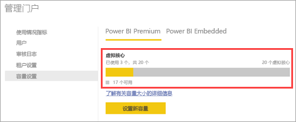

# 如何购买 Power BI Premium

> [!NOTE]
> 本文目前正在更新，以说明新功能，提供更多详细信息并提高可读性。 

本文介绍如何为你的组织购买 Power BI 高级容量 (P1-P3)。 在 Microsoft 365 管理中心购买 Power BI Premium 容量并在 Power BI 管理门户中管理容量。 有关当前定价和计划的信息，请参阅 [Power BI 定价页](https://powerbi.microsoft.com/pricing/)和 [Power BI Premium 计算器](https://powerbi.microsoft.com/calculator/)。

即使你的组织使用 Power BI Premium，内容创建者还是需要一个 Power BI Pro 许可证。 请确保为组织购买至少一个 Power BI Pro 许可证。

如果 Premium 订阅到期，将有 30 天的容量完全访问权限。 之后，内容将恢复为共享容量。 共享容量不支持大于 1 GB 的模型。

## 使用 Power BI Premium P1 新建租户

如果尚无租户并且想要创建一个，可以同时购买 Power BI Premium。 单击以下链接后，可了解创建新租户的过程，并可购买 Power BI Premium：[Power BI Premium P1 套餐](https://signup.microsoft.com/Signup?OfferId=b3ec5615-cc11-48de-967d-8d79f7cb0af1)。 创建租户时，将自动为该租户分配 Office 365 全局管理员角色。

## 为现有组织购买 Power BI Premium 容量

若有现有组织（租户），则必须具有 Office 365 全局管理员角色或帐务管理员角色才能购买订阅和许可证。 有关详细信息，请参阅[关于 Office 365 管理员角色](https://support.office.com/article/About-Office-365-admin-roles-da585eea-f576-4f55-a1e0-87090b6aaa9d)。

要购买高级容量，请按照下列步骤操作。

1. 在 Power BI 服务中，选择“Office 365 应用选取器”，然后选择“管理员”。

    

    或者，可以浏览到 Microsoft 365 管理中心。 如需访问，请转到 https://portal.office.com 并选择“管理员”。

1. 选择“计费” > “购买服务”。

1. 在“其他计划”下查找 Power BI Premium 优惠。 这将会列出 P1 至 P3、EM3 和 P1（按月）。

1. 将鼠标悬停在省略号 (...) 上，然后选择“立即购买”。

    

1. 按照以下步骤完成购买。

完成购买后，“购买服务”页将显示该项目已购买且处于活动状态。

## 购买额外容量

现在已有容量，可随着需求的增长添加更多容量。 可以在组织中使用任何高级容量 SKU（P1 到 P3）组合。 不同的 SKU 提供不同的资源容量。

1. 在 Microsoft 365 管理中心内，选择“账单” > “购买服务”。

1. 在“其他计划”下找到需额外购买的 Power BI Premium 项目。

1. 将鼠标悬停在“省略号 (...)”上，然后选择“更改许可证数量”。

    

1. 更改此项目需要具有的实例数。 完成后，选择“提交”。

   > [!IMPORTANT]
   > 选择“提交”将对记录的信用卡收取费用。

然后“购买服务”页面上将显示你拥有的实例数。 在 Power BI 管理门户的“容量设置”下，可用的 V 核心反映购买的新容量。

## 取消订阅

可以在 Microsoft 365 管理中心内取消订阅。 若要取消 Premium 订阅，请执行以下操作。

1. 浏览到 Microsoft 365 管理中心。

1. 依次选择“计费” > “订阅”。

1. 从列表中选择 Power BI Premium 订阅。

1. 选择“更多操作” > “取消订阅”。

1. “取消订阅”页会指明是否需要支付[提前终止费](https://support.office.com/article/early-termination-fees-6487d4de-401a-466f-8bc3-c0beb5cc40d3)。 此页还会指明何时删除订阅数据。

1. 请仔细阅读这些信息。若要继续，请选择“取消订阅”。

### 取消订阅或许可证到期时

取消高级订阅或容量许可证到期时，可以在取消或许可证到期之日起的 30 天内继续访问高级容量。 30 天后，将无法再访问高级容量或其中的工作区。

## 后续步骤

[Power BI 定价页](https://powerbi.microsoft.com/pricing/)   
[Power BI Pemium 计算器](https://powerbi.microsoft.com/calculator/)   
[Power BI Premium 常见问题解答](service-premium-faq.md)   
[规划 Power BI Enterprise 部署白皮书](https://aka.ms/pbienterprisedeploy)

更多问题？ [尝试咨询 Power BI 社区](http://community.powerbi.com/)