# Power BI 中的自动机器学习（预览）

自动用于机器学习 (AutoML) 数据流，业务分析员可训练、 验证和调用直接在 Power BI 中的机器学习模型。 它包括用于创建新的机器学习模型的分析师可以使用其数据流以指定用于定型模型的输入的数据的简单体验。 该服务会自动提取最相关的功能、 选择适当的算法和调整并对机器学习模型进行验证。 定型模型后，Power BI 自动生成包含介绍了性能的验证的结果和分析师到结果的报告。 然后可以在数据流中的任何新的或更新数据中调用模型。

自动化的机器学习是适用于 Power BI Premium 和嵌入容量托管的数据流。 在此预览版中，可使用 AutoML 训练的二元预测、 分类和回归模型的机器学习模型。

## 使用 AutoML

[Power BI 数据流](service-dataflows-overview.md)提供自助服务数据准备适用于大数据。 AutoML 可以利用用于构建机器学习模型，直接在 Power BI 您对数据的准备工作。

在 Power BI 中的 AutoML 使数据分析师可以使用数据流生成的机器学习模型，通过简化的体验，使用只是 Power BI 技能。 创建机器学习模型的数据科学的大部分可以自动完成 Power BI 与 guardrails 以确保生成的模型具有高质量，并为你提供用于创建机器学习模型的过程的完整深入的可见性。

AutoML 支持创建**二元预测**，**分类**，并**回归**数据流的模型。 这些是类型的受监督的机器学习模型，这意味着他们了解从过去的观测值来预测结果的其他观察已知结果加权。 AutoML 模型定型的输入数据集是一组的记录均**标记为**与已知结果加权。

集成 Power BI 中的 AutoML[自动 ML](https://docs.microsoft.com/azure/machine-learning/service/concept-automated-ml)从[Azure 机器学习服务](https://docs.microsoft.com/azure/machine-learning/service/overview-what-is-azure-ml)创建机器学习模型。 但是，不需要 Azure 订阅才能在 Power BI 中使用 AutoML。 培训和托管的机器学习模型的过程管理完全由 Power BI 服务中。

机器学习模型进行定型后，AutoML 自动生成 Power BI 报表，说明您的机器学习模型可能存在性能。 AutoML 强调 explainability，通过突出显示影响返回的模型的预测你输入之间的关键影响因素。 此报表还包含关键指标的模型，具体取决于机器学习模型类型。

生成的报表的其他页显示的模型和培训的详细信息的统计摘要。 想要看到的模型标准数据科学度量值的用户感兴趣的是性能的统计摘要。 培训的详细信息总结了运行，目的是使用关联的建模的参数创建您的模型的所有迭代。 它还介绍了如何使用每个输入来创建机器学习模型。

然后可以将机器学习模型应用到你的数据进行评分。 刷新数据流时，从机器学习模型的预测会自动应用到你的数据。 Power BI 还包括对机器学习模型生成每个特定的预测得分的个性化的解释。

## 创建机器学习模型

本部分介绍如何创建 AutoML 学习模型。 

### 创建机器学习模型的数据准备

若要在 Power BI 中创建的机器学习模型，必须先使用历史结果信息，用于定型的机器学习模型创建的数据的数据流。 有关配置到数据流的详细信息，请参阅[在 Power BI 中的自助服务数据准备](service-dataflows-overview.md)。

在当前版本中，Power BI 使用单个实体中的数据来训练机器学习模型。 因此如果你的历史数据包含多个实体，必须手动加入数据转换为单一数据流的实体。 您还应添加任何可能会想要预测的结果的强预测因子的业务指标的计算的的列。

AutoML 具有特定的数据用于训练机器学习模型的要求。 这些要求各节所述，根据相应的模型类型。

### 配置机器学习模型输入

若要创建 AutoML 模型，选择中的 ML 图标**操作**与历史数据，然后选择数据流实体的列**添加机器学习模型**。

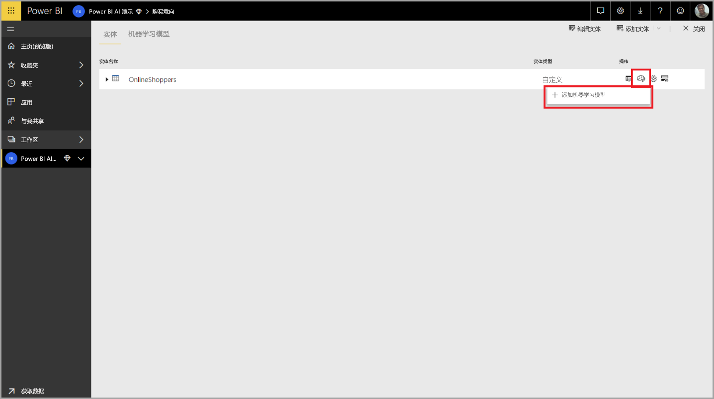

简化的体验，会启动一个向导，指导您完成创建机器学习模型的过程组成。 该向导包括以下简单步骤。

1. 选择历史结果数据，且要预测的字段的实体
2. 选择你想要看到的预测类型所基于的模型类型
3. 选择你想要用作预测的信号的模型的输入
4. 命名您的模型并将保存你的配置

历史结果字段标识用于训练机器学习模型，在下图中所示的标签属性。

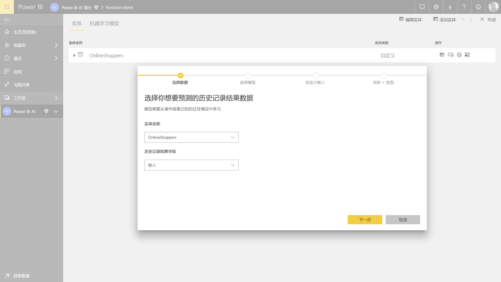

当指定历史结果字段时，AutoML 分析标签数据以确定可以为该数据训练的机器学习模型的类型，并提供建议最有可能可以训练的机器学习模型类型。 

> [!NOTE]
> 所选的数据可能不支持某些模型类型。

AutoML 还分析来建议可以用于定型的机器学习模型的输入所选实体中的所有字段。 此过程是近似值，基于统计分析，因此你应查看使用的输入。 任何依赖于历史结果字段 （或标签字段） 的输入不应该用于训练机器学习模型，因为它们将会影响其性能。

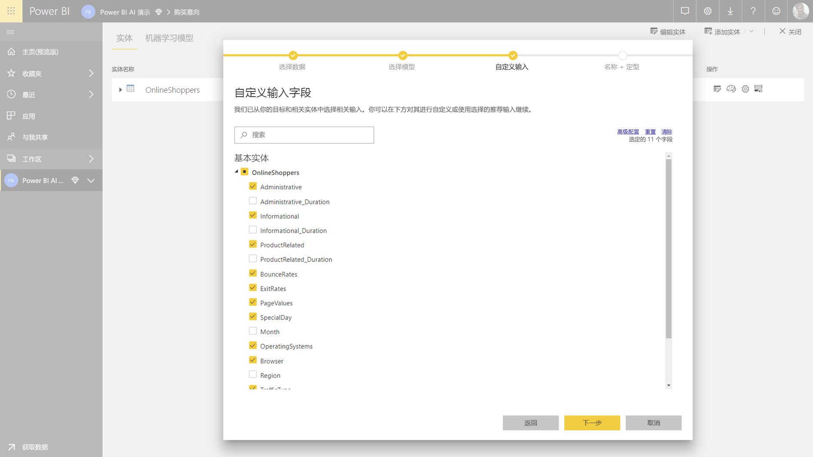

在最后一步，可以为模型命名并保存其设置。

在此阶段，系统会提示以刷新数据流，其开始机器学习模型训练过程。

### 机器学习模型训练

AutoML 模型的训练是数据流刷新的一部分。 AutoML 首先准备用于定型的数据。

AutoML 将拆分为训练集和测试数据集提供的历史数据。 测试数据集是用于验证训练后的模型性能的维持集。 作为实现这些**定型集和测试**数据流中的实体。 AutoML 使用交叉验证模型验证。

接下来，分析每个输入的字段，并应用插补，这将使用被替换的值替换任何缺失值。 AutoML 使用几个不同的插补的策略。 然后，任何所需的采样和规范化应用到你的数据。

AutoML 应用多个转换就是每个所选的输入的字段，根据其数据类型和其统计属性。 AutoML 使用这些转换来提取用于定型机器学习模型的功能。

AutoML 模型训练过程包括使用不同的建模算法和超参数设置以查找具有最佳性能模型的最多 50 个迭代。 通过使用维持测试数据集验证评估的每个这些模型的性能。 在此培训步骤中，AutoML 创建多个管道，以了解这些迭代的培训和验证。 评估模型的性能的过程可能需要时间，范围从几分钟到几个小时，具体取决于你的数据集和可用的专用的容量资源的大小。

在某些情况下，生成的最后一个模型可以使用系综学习，使用多个模型以提供更好地预测的性能。

### AutoML 模型 explainability

训练模型后，AutoML 分析的输入的特征和模型输出之间的关系。 它将评估的大小和方向到每个输入功能的维持测试数据集的模型输出的更改。 这称为*功能重要性*。

### AutoML 模型报表

AutoML 生成 Power BI 报表，汇总模型的验证，以及全局特征重要性期间的性能。 报告用于汇总将机器学习模型应用于维持测试数据和比较与已知的结果值预测的结果。

您可以查看该模型报表来了解其性能。 您还可以验证模型的关键影响因素符合有关已知结果加权的业务见解。

图表和度量值用于描述在报表中的模型性能取决于模型类型。 这些性能图表和度量值是以下各节所述。

在报表中的其他页可能描述信息将模型从数据科学的角度的统计度量值。 例如，**二元预测**报告包括提升图和模型的 ROC 曲线。

这些报表还包括**培训的详细信息**页，其中包含如何模型进行定型，并包括对每个迭代描述模型性能图表的说明运行。

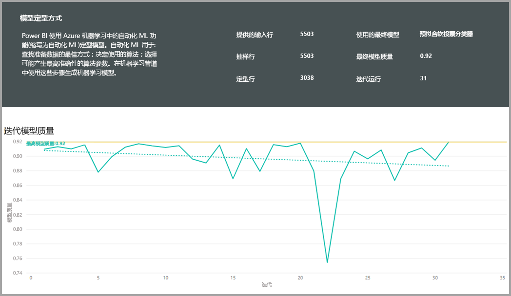

此页上的另一个部分介绍如何插补方法用于填充缺失值的输入字段，以及如何为每个输入的字段进行转换以提取模型中使用的功能。 它还包括在最终模型使用的参数。

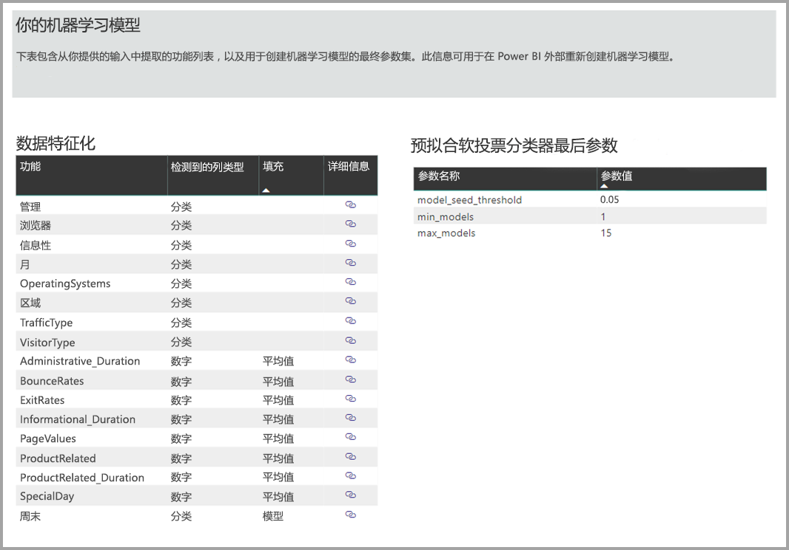

如果生成的模型使用的系综学习，则**培训的详细信息**页面还包括一节介绍了在系综，以及其参数中每个构成模型的权重。

## 应用 AutoML 模型

如果您创建的机器学习模型的性能感到满意，您可以将其应用到新的或更新数据中，当刷新到数据流。 您可以选择执行此模型报表中，**应用**在右上角的按钮。

若要应用机器学习模型，必须指定它必须应用于，将实体和前缀的列将添加到模型输出此实体的名称。 列名称的默认前缀是模型名称。 *应用*函数可能包括特定于模型类型的其他参数。

将机器学习模型应用创建一个新的数据流实体带有后缀**丰富 < model_name >** 。 例如，如果将应用_PurchaseIntent_模型到_OnlineShoppers_实体，将生成输出**OnlineShoppers 丰富 PurchaseIntent**。

目前，输出实体不能用于预览 Power Query 编辑器中的机器学习模型结果。 输出列始终显示 null 作为结果。 若要查看结果，第二个输出实体带有后缀**丰富 < model_name > 预览**应用模型时创建。

您必须刷新数据流，以预览结果在查询编辑器中。

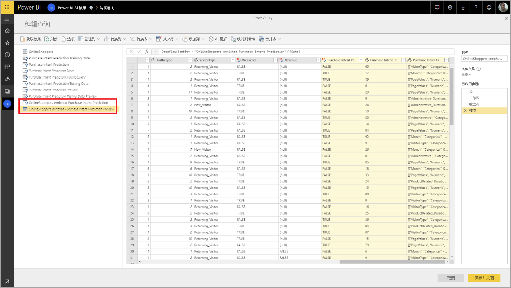

当您应用模型时，AutoML 始终使预测保持最新刷新数据流时。

AutoML 还包括个性化其评分的每一行说明输出实体中。

若要在 Power BI 报表中使用的见解和机器学习模型的预测，您可以从连接到输出实体使用 Power BI Desktop**数据流**连接器。

## 二元预测模型

二元预测模型，更准确地讲称为**二元分类模型**，用于对数据集分为两组进行分类。 它们用于预测事件可以具有二进制结果，例如是否会将转换销售机会，是否会流失的帐户，是否将在时间; 支付发票无论事务是具有欺骗性等。

由于二进制结果是，Power BI 需要二进制预测模型是一个布尔值，与已知结果加权被标记为标签 **，则返回 true**或**false**。 例如，在销售机会转换模型中，已结束-赢得的销售机会标记为 true、 那些已丢失标记为 false，并打开销售机会标记为 null。

二元预测模型的输出是一个概率分数，它标识将实现均为 true 的标签值对应的结果的可能性。

### 二元预测模型定型

若要创建二进制预测模型，其中包含将训练数据的输入的实体必须具有历史结果字段来标识过去已知结果加权布尔字段。

系统必备组件：

* 一个布尔字段必须用作历史结果字段
* 50 行的历史数据的最小值是所必需的结果中的每个类

一般情况下，如果过去的结果由不同的数据类型的字段，则可以添加计算的列可以转换这些内容使用 Power Query 的布尔值。

创建的过程为二元预测模型遵循相同步骤一节中描述其他 AutoML 模型**配置机器学习模型输入**上面。

### 二进制预测模型报表

二进制预测模型作为输出生成一条记录将会获得的结果为 True 的布尔值的标签值定义的概率。 此报表包含的概率阈值，这会影响如何解释分数的上方和下方的概率阈值的切片器。

报告描述的模型的性能*真正*，*误报*，*真负*和*假负*. True 正和真负结果数据中的两个类的正确预测的结果。 用于在有实际的布尔值标签的值设置为 False，但预测为 true，则结果会发生误报。 与之相反，假负是的结果是 True 实际布尔标签值的位置，而预测为 False。

度量值，例如精度和召回率，介绍预测结果的概率阈值的效果。 概率阈值切片器用于选择可实现精度和召回率之间的平衡的折的阈值。

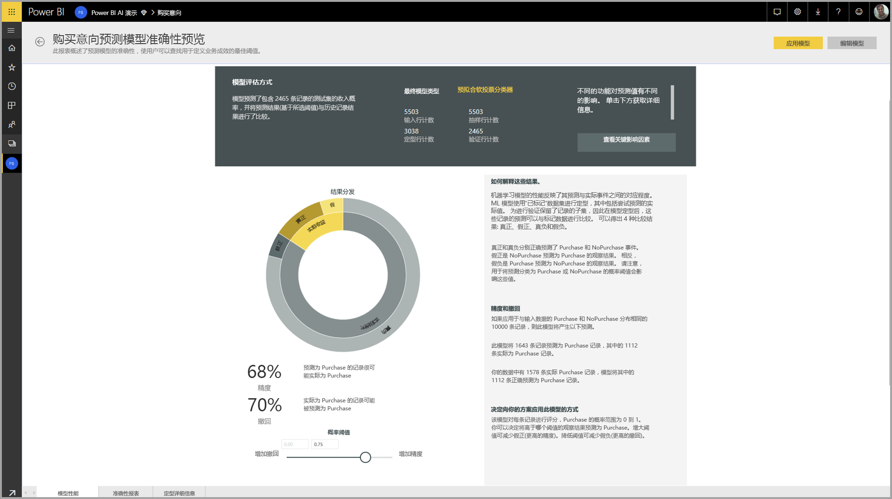

**准确性报表**模型报表页包括*累积*图表和 ROC 曲线的模型。 这些是模型性能的统计度量值。 这些报表包括图表所示的说明。

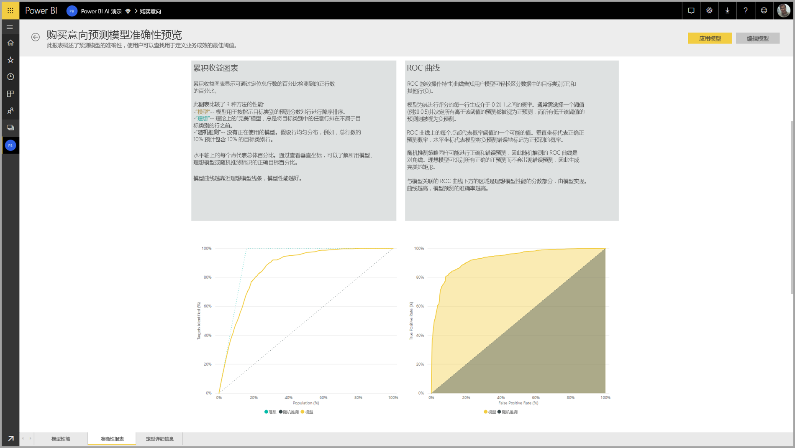

### 应用的二元预测模型

若要应用的二元预测模型，必须与你想要将应用从机器学习模型的预测数据中指定的实体。 其他参数包括输出列名称前缀和分类预测的结果的概率阈值。

应用的二元预测模型时，它向丰富的输出实体添加三个输出列。 这些是**PredictionScore**， **PredictionOutcome**并**PredictionExplanation**。 实体中的列名称已指定应用该模型时的前缀。

**PredictionOutcome**列包含预测的结果标签。 记录具有超过了阈值的概率被预测为有可能实现的结果，以及下面预测为不太可能实现的结果。

**PredictionExplanation**列包含与特定的输入的特征有的影响说明**PredictionScore**。 这是用于预测的输入特征权重的 JSON 格式集合。

## 分类模型

分类模型用于数据集分成多个组或类。  它们用于预测可以具有多个可能的结果，如客户是否可能具有非常高、 高、 中或低的生存期值; 之一的事件默认情况下的风险是高、 中等、 低或非常低;等等。

分类模型的输出是一个概率分数，用于标识一条记录将会获得给定类的条件的可能性。

### 定型分类模型

包含分类模型将训练数据的输入的实体必须具有字符串或数字字段作为历史结果字段，指定过去的已知结果加权。

系统必备组件：

* 50 行的历史数据的最小值是所必需的结果中的每个类

创建过程的分类模型遵循相同的步骤与其他 AutoML 模型中，部分所述**配置机器学习模型输入**上面。

### 分类模型报表

分类模型报表由将机器学习模型应用于维持测试数据和比较的记录的实际已知类与预测的类。

模型报表包括包含的每个已知的类的分类正确和错误分类记录细分的图表。

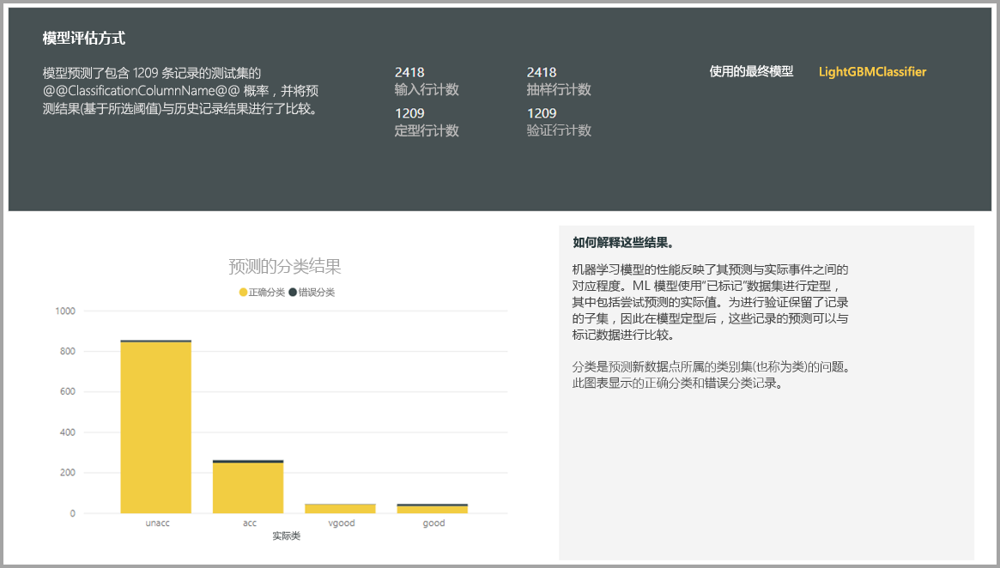

更多特定于类的向下钻取使已知类的预测如何分布的分析。 这包括在其中的已知类记录很可能被错误分类的其他类。

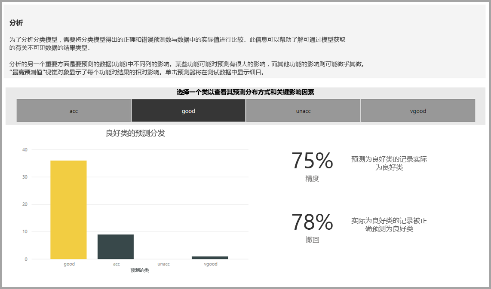

在报表中的模型说明还包括每个类顶部的预测值。

分类模型报表还包括类似于其他模型类型的页的培训的详细信息页面的部分中所述**AutoML 模型报表**本文前面部分。

### 应用分类模型

若要应用分类机器学习模型，必须与输入的数据和输出列名称前缀指定的实体。

应用分类模型，它会添加三个输出的丰富的输出实体的列。 这些是**PredictionScore**， **PredictionClass**并**PredictionExplanation**。 实体中的列名称已指定应用该模型时的前缀。

**PredictionClass**列包含的记录很可能预测的类。 **PredictionScore**列包含的记录的每个可能的类的概率分数的列表。

**PredictionExplanation**列包含与特定的输入的特征有的影响说明**PredictionScore**。 这是用于预测的输入特征权重的 JSON 格式集合。

## 回归模型

使用回归模型来预测某个值，如有可能实现从销售交易，帐户的生存期值，可能要支付，可能会在其支付发票的日期应收帐款发票量收入依次类推。

回归模型的输出是预测的值。

### 训练回归模型

包含一个回归模型的定型数据的输入的实体必须具有数值字段历史结果字段，指定过去的已知的结果值。

系统必备组件：

* 历史数据的 100 行的最小值是所必需的回归模型

创建过程的回归模型遵循相同的步骤与其他 AutoML 模型中，部分所述**配置机器学习模型输入**上面。

### 回归模型的报表

其他 AutoML 模型与报表类似，回归报表基于此模型应用于维持测试数据的结果。

模型报表包括比较预测的值与实际值的图表。 在此图中，从对角线的距离指示在预测中的错误。

剩余错误图表显示中维持测试数据集的不同值的平均误差的百分比的分布。 水平轴表示该范围中显示的频率或的值的计数的气泡大小的组的实际值的平均值。 垂直轴是平均剩余错误。

回归模型报表还包括与其他模型类型，为报表类似的培训的详细信息页的部分中所述**AutoML 模型报表**上面。

### 应用的回归模型

若要应用回归机器学习模型，必须与输入的数据和输出列名称前缀指定的实体。

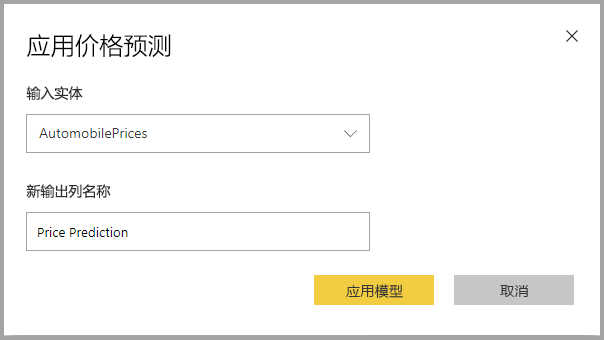

应用的回归模型时，它将两个输出列添加到丰富的输出实体。 这些是**PredictionValue**，并**PredictionExplanation**。 实体中的列名称已指定应用该模型时的前缀。

**PredictionValue**列包含根据输入字段的记录的预测的值。 **PredictionExplanation**列包含与特定的输入的特征有的影响说明**PredictionValue**。 这是 JSON 格式的输入特征权重的集合。

## 后续步骤

本文提供有关 Power BI 服务中的数据流自动机器学习的概述。 以下文章也可能会很有用。

* [教程：生成 Power BI （预览版） 中的机器学习模型](service-tutorial-build-machine-learning-model.md)
* [教程：在 Power BI 中使用认知服务](service-tutorial-use-cognitive-services.md)
* [教程：在 Power BI 中调用机器学习工作室模型（预览版）](service-tutorial-invoke-machine-learning-model.md)
* [Power BI 中的认知服务（预览版）](service-cognitive-services.md)
* [Power BI 中的 Azure 机器学习集成（预览版）](service-machine-learning-integration.md)

有关数据流的详细信息，可以阅读以下这些文章：
* [在 Power BI 中创建和使用数据流](service-dataflows-create-use.md)
* [使用 Power BI Premium 上的计算的实体](service-dataflows-computed-entities-premium.md)
* [数据流中使用的本地数据源](service-dataflows-on-premises-gateways.md)
* [Power BI 数据流的开发人员资源](service-dataflows-developer-resources.md)
* [数据流和 Azure Data Lake 集成（预览）](service-dataflows-azure-data-lake-integration.md)

