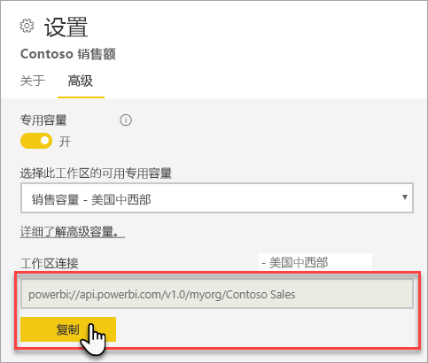
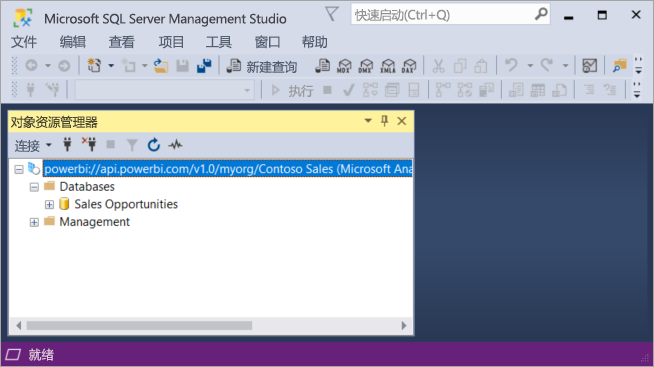

# 连接到数据集与客户端应用程序和工具 （预览版）

Power BI Premium 工作区和数据集支持*只读*来自 Microsoft 和第三方客户端应用程序和工具的连接。 

> [!NOTE]
> 这篇文章仅用于引入到 Power BI Premium 工作区和数据集的只读连接。 它*不是*旨在提供有关可编程性、 特定的工具和应用程序、 体系结构和工作区和数据集管理的详细信息。 此处所述的使用者需要深入了解 Analysis Services 表格模型数据库体系结构和管理。

## 协议

Power BI Premium 使用[XML for Analysis](https://docs.microsoft.com/bi-reference/xmla/xml-for-analysis-xmla-reference) (XMLA) 协议用于客户端应用程序和管理你的工作区和数据集引擎之间的通信。 这些通信是通过什么通常所说的作为 XMLA 终结点。 XMLA 是由 Microsoft Analysis Services 引擎，它实质上，运行 Power BI 语义建模、 监管、 生命周期和数据管理的相同通信协议。 

大多数客户端应用程序和工具不显式通信与引擎通过使用 XMLA 终结点。 相反，它们使用 MSOLAP、 ADOMD 和 AMO 等的客户端库作为客户端应用程序和以独占方式通过使用 XMLA 进行通信的引擎之间的媒介。

## 支持的工具

这些工具支持到 Power BI Premium 工作区和数据集的只读访问权限：

**SQL Server Management Studio (SSMS)** -支持 DAX、 MDX、 XMLA 和 TraceEvent 查询。 需要版本 18.0。 下载[此处](https://docs.microsoft.com/sql/ssms/download-sql-server-management-studio-ssms)。 

**SQL Server Profiler** -附带 SSMS 18.0 （预览版），此工具提供了跟踪和调试服务器事件。 可以捕获，并将有关每个事件数据保存到文件或表中供以后分析。 虽然正式弃用适用于 SQL Server，Profiler 继续包含在 SSMS 中，仍受支持的 Analysis Services 和现在，Power BI Premium。 若要了解详细信息，请参阅[SQL Server Profiler](https://docs.microsoft.com/sql/tools/sql-server-profiler/sql-server-profiler)。

**DAX Studio** -开放源社区工具来执行和分析 DAX 查询对 Analysis Services。 需要版本 2.8.2 或更高版本。 若要了解详细信息，请参阅[daxstudio.org](https://daxstudio.org/)。

**Excel 数据透视表**-即用版本的 Office 16.0.11326.10000 或更高版本是必需的。

**第三方**-包括客户端数据可视化应用程序和工具，可以连接到、 查询和使用 Power BI Premium 中的数据集。 大多数工具需要最新版本的 MSOLAP 客户端库，但一些可以使用 ADOMD。

## 客户端库

客户端库所需的客户端应用程序和工具连接到 Power BI Premium 工作区。 Power BI Premium 还支持用于连接到 Analysis Services 的同一个客户端库。 Microsoft 客户端应用程序，如 Excel、 SQL Server Management Studio (SSMS) 和 SQL Server Data Tools (SSDT) 安装所有三个客户端库，并更新它们以及普通应用程序的更新。 在某些情况下，尤其是对于第三方应用程序和工具，您可能需要安装较新版本的客户端库。 客户端库会每月更新。 若要了解详细信息，请参阅[用于连接到 Analysis Services 客户端库](https://docs.microsoft.com/azure/analysis-services/analysis-services-data-providers)。

## 连接到 Premium 工作区

你可以连接到分配到高级版专用容量的工作区。 分配给专用容量的工作区中的 URL 格式有一个连接字符串。 

若要获取工作区连接字符串，在 Power BI 中，在**工作区设置**，然后在**Premium**选项卡上，在**工作区连接**，单击**复制**.

工作区连接使用以下 URL 格式为工作区，就好像它是 Analysis Services 服务器名称：   
`powerbi://api.powerbi.com/v1.0/[tenant name]/[workspace name]` 

例如， `powerbi://api.powerbi.com/v1.0/contoso.com/Sales Workspace`
> [!NOTE]
> `[workspace name]` 是区分大小写，可以包含空格。 

### 若要在 SSMS 中连接

在中**连接到服务器** > **服务器类型**，选择**Analysis Services**。 在中**服务器名称**，输入的 URL。 在中**身份验证**，选择**Active Directory-通用且具有 MFA 支持**，然后在**用户名**，输入你的组织用户 id。 

连接后，在工作区显示为 Analysis Services 服务器，并在工作区中的数据集如下所示的数据库。  

### 初始目录

一些工具，如 SQL Server Profiler，您可能需要指定*Initial Catalog*。 在工作区中指定的数据集 （数据库）。 在中**连接到服务器**，单击**选项**。 在中**连接到服务器**对话框，然后在**连接属性**选项卡上，在**连接到数据库**，输入数据集名称。

### 工作区名称重复

连接到另一个工作区与同名的工作区时，可能会收到以下错误：**无法连接到 powerbi://api.powerbi.com/v1.0/ [租户名称] / [工作区名称]。**

若要解决此错误，除了工作区名称，指定对象 Idguid，可以从 URL 中的工作区 objectID 复制。 追加到连接 URL 的 objectID。 例如，powerbi://api.powerbi.com/v1.0/myorg/Contoso 销售额-9d83d204-82a9-4b36-98f2-a40099093830

### 重复的数据集名称

连接到具有相同的名称相同的工作区中的另一个数据集的数据集时，将数据集 guid 追加到数据集名称。 你可以获取这两个数据集名称*和*guid 时连接到 SSMS 中的工作区。 

### 延迟中所示的数据集

连接到工作区时，从新的、 已删除和重命名数据集的更改可能需要 5 分钟才会显示。 

### 不受支持的数据集

通过使用 XMLA 终结点的以下数据集不可访问。 这些数据集*将不会*显示在 SSMS 中或其他工具的工作区下： 

- 通过实时连接到 Analysis Services 模型的数据集。 
- 使用 REST API 推送数据的数据集。
- Excel 工作簿的数据集。 

在 Power BI 服务中不支持以下数据集：   

- 通过实时连接到 Power BI 数据集的数据集。

## 审核日志 

当客户端应用程序和工具连接到工作区时下的 Power BI 审核日志中记录通过 XMLA 终结点的访问权限**GetWorkspaces**操作。 若要了解详细信息，请参阅[审核 Power BI](service-admin-auditing.md)。

## 另请参阅

[Analysis Services 的引用](https://docs.microsoft.com/bi-reference/#pivot=home&panel=home-all)   
[SQL Server Management Studio](https://docs.microsoft.com/sql/ssms/sql-server-management-studio-ssms)   
[SQL Server Analysis Services 表格协议](https://docs.microsoft.com/openspecs/sql_server_protocols/ms-ssas-t/b98ed40e-c27a-4988-ab2d-c9c904fe13cf)   
[动态管理视图 (Dmv)](https://docs.microsoft.com/sql/analysis-services/instances/use-dynamic-management-views-dmvs-to-monitor-analysis-services)   

更多问题？ [尝试咨询 Power BI 社区](https://community.powerbi.com/)
