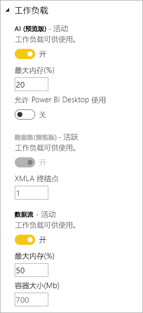

# 什么是 Power BI Premium？

Power BI Premium 提供专用的和增强的资源来运行你的组织的 Power BI 服务。 例如：

- 更高的规模和性能
- 灵活地通过容量的许可证
- 将自助服务和企业 BI 统一
- 扩展使用 Power BI 报表服务器的本地 BI
- 针对数据驻留位置按区域 （多地域） 的支持
- 与任何人共享数据，而无需购买每用户许可证

本文并不实际提供有关 Power BI Premium 的所有功能的深入详细信息，它只是涉及在图面。 必要时，提供具有更多详细信息的其他文章的链接。

## 订阅和授权

Power BI Premium 是租户级 Office 365 订阅中两个 SKU/单位 （库存单位） 系列提供：

- **EM** Sku (EM1 EM3) 嵌入内容，要求每年承诺，按每月计费。
- **P** Sku (P1-P3) 嵌入内容和企业功能，需要每月或每年承诺，每月计费，包括 Power BI 报表服务器安装在本地安装的许可证。

另一种方法是购买**Azure Power BI Embedded**订阅，其中包含单个**A**仅用于嵌入和容量测试 (A1 A6) SKU 系列目的。 所有 Sku 都提供的 v 核心来创建容量，但受限制，较小的规模嵌入 EM Sku。 EM1、 EM2、 A1 和 A2 Sku 具有少于四个虚拟核心不要专用基础结构上运行。

虽然这篇文章的重点是 P Sku，大部分描述的内容也是 A Sku 与相关。 与高级版订阅的 Sku，Azure Sku 不需要时间做出任何承诺，并且按小时计费。 它们提供完整的灵活性使缩放其向上、 向下缩放、 暂停、 恢复和删除。 

Azure Power BI Embedded 是很大程度上不在范围内的这篇文章，但所述[测试方法](service-premium-capacity-optimize.md#testing-approaches)作为今天这样切实可行且经济的选项进行测试和测量工作负荷优化的高级容量本文的相关部分。 若要了解有关 Azure Sku 的详细信息，请参阅[Azure Power BI Embedded 文档](https://azure.microsoft.com/services/power-bi-embedded/)。

### 购买

由 Microsoft 365 管理中心中的管理员来购买 power BI Premium 订阅。 具体而言，只有 Office 365 全局管理员或计费管理员才可以购买的 Sku。 如果购买的租户会获得对应数量的 v 核心数，以将分配给容量，称为*v 核心池*。 例如，购买 P3 SKU 会为租户提供 32 的 v 核心。 若要了解详细信息，请参阅[如何购买 Power BI Premium](service-admin-premium-purchase.md)。

## 专用的容量

使用 Power BI Premium，您可以得到*专用容量*。 与共享容量中其中与其他客户共享计算资源运行的工作负荷，相比具有专用的容量，是供组织独占使用。 隔离的专用计算资源提供可靠且一致的性能承载的内容。 

工作区都位于容量中。 每个 Power BI 用户都称为一个个人工作区**我的工作区**。 可以创建额外的工作区以实现协作和部署，并且这些参数称为**应用工作区**。 默认情况下共享容量中创建工作区，包括个人工作区。 高级容量后，可以将我的工作区和应用工作区分配给高级容量。

### 容量节点

如中所述[订阅和许可](#subscriptions-and-licensing)部分中，有两个 Power BI Premium SKU 系列：**EM**并**P**。所有 Power BI Premium Sku 都是可为容量*节点*，每个表示设置的资源组成处理器、 内存和存储量。 除了资源外，每个 SKU 的每秒，DirectQuery 和实时连接的连接数有操作限制并并行模型数刷新。

处理通过一定的 v 核心后, 端和前端之间平均分配。

**后端虚拟核心**负责核心 Power BI 功能，包括查询处理、 缓存管理、 运行 R services、 模型刷新、 自然语言处理 （问答） 和服务器端呈现的报表和图像。 后端虚拟核心分配给主机模式，也称为活动数据集固定的主要使用的内存量。

**前端虚拟核心**会负责 web 服务、 仪表板和报表文档管理、 访问 rights management、 时间安排、 Api、 上传和下载，并通常与用户相关的事物的体验。

存储设置为**每个容量节点 100 TB**。

资源和每个高级 SKU 的限制 （和具有相对大小 SKU） 以下表所述：

| 容量节点 | 总虚拟核心 | 后端 V 核心 | RAM (GB) | 前端 V 核心 | DirectQuery/实时连接 （每秒） | 模型刷新并行度 |
| --- | --- | --- | --- | --- | --- | --- |
| EM1/A1 | 1 | 0.5 | 2.5 | 0.5 | 3.75 | 1 |
| EM2/A2 | 2 | 1 | 5 | 1 | 7.5 | 2 |
| EM3/A3 | 4 | 2 | 10 | 2 | 15 | 3 |
| P1/A4 | 8 | 4 | 25 | 4 | 30 | 6 |
| P2/A5 | 16 | 8 | 50 | 8 | 60 | 12 |
| P3/A6 | 32 | 16 | 100 | 16 | 120 | 24 |
| | | | | | | |

### 容量的工作负荷

容量的工作负荷是对用户可用的服务。 默认情况下，高级版和 Azure 容量支持仅与运行 Power BI 查询相关联的数据集工作负荷。 不能禁用数据集工作负荷。 可以为启用额外的工作负载[AI （认知服务）](https://powerbi.microsoft.com/blog/easy-access-to-ai-in-power-bi-preview/)，[数据流](service-dataflows-overview.md#dataflow-capabilities-on-power-bi-premium)，并[分页报表](paginated-reports-save-to-power-bi-service.md)。 在高级版订阅仅支持这些工作负荷。 

每个额外的工作负荷允许配置可由工作负荷的最大内存 （作为总可用内存的百分比表示）。 按 SKU 确定最大内存的默认值。 可以使用，从而仅这些额外的工作负载来最大化容量的可用资源。 并且可以更改设置仅在确定默认设置不能满足你的容量资源要求的内存。 可以启用和配置为容量的容量管理员使用的工作负荷**容量设置**中[管理门户](service-admin-portal.md)或通过使用[容量 REST Api](https://docs.microsoft.com/rest/api/power-bi/capacities)。  

若要了解详细信息，请参阅[在高级容量中配置工作负荷](service-admin-premium-workloads.md)。 

### 如何容量函数

在任何时候，Power BI 服务使最佳使用容量资源，同时不超出容量限制。

容量的操作被归类为任一*交互式*或*背景*。 交互式操作包括呈现请求和响应用户交互 （筛选、 问答查询等）。 通常情况下，导入模型查询是内存占用大量资源，而查询 DirectQuery 和实时连接模型是大量占用 CPU。 后台操作包含数据流和导入模型刷新和仪表板查询缓存。

请务必了解交互操作将始终优先于后台操作，以确保最可能的用户体验。 如果有足够的资源，后台操作被添加到一个队列用于处理当资源释放。 后台操作，如数据集刷新，可以通过 Power BI 服务已停止中间的进程，并且添加到队列。

导入模型必须完全加载到内存，因此可以查询或刷新。 Power BI 服务管理内存使用的使用复杂的算法，以确保最充分地利用可用内存，并可能导致过度提交容量：虽然可能最多可存储多个导入的模型 (每个高级容量最多 100 TB)，当他们组合的磁盘的存储超出了支持的内存 （和更多的内存是查询和刷新所必需的），然后它们均不能为加载到内存中相同的时间。

因此，导入模型是加载到和从根据使用情况的内存中删除。 导入模型加载时它查询 （交互式操作） 和尚不在内存中，或者当它是要刷新 （后台操作）。

将模型从内存中的删除名为*逐出*。 它是的操作 Power BI 可以快速执行具体取决于模型的大小。 如果容量未遇到任何内存不足的情况，只需加载到内存和模型一直留在那里。 但是，可用于加载模型内存不足时，Power BI 服务将首先需要释放内存。 它通过检测通过设法在过去三分钟内未使用过的模型已变为不活动状态的模型来释放内存\[ [1](#endnote-1)\]，，然后将它们逐出。 如果没有处于非活动状态模型中收回，Power BI 服务将设法逐出的后台操作加载的模型。 最后的手段，在 30 秒的失败尝试后\[ [1](#endnote-1)\]，是交互式操作失败。 在这种情况下，报表用户使用一项建议，若要稍后重试失败的通知。 在某些情况下，模型可能是从服务操作由于内存中卸载。

请务必强调数据集逐出处于正常和预期行为。 它致力于实现最大内存使用情况加载和卸载的模型合并的大小可能会超过可用内存。 这是通过设计，与报表用户完全透明。 高驱逐率不一定意味着不足的资源容量。 如果查询或刷新响应能力，正是由于高驱逐率，他们便可以但是，会成为问题。

刷新的导入模型始终会消耗大量内存，因为必须加载到内存中模型。 需要处理更多的内存。 完全刷新可以使用大约两倍的模型所需的内存量。 这可确保该模型可以查询即使正在处理，因为查询发送到现有模型中，直到刷新已完成并且有可用的新模型数据。 增量刷新都需要较少的内存和更快，无法完成，因此可以显著减少容量资源的压力。 刷新也可以是大量占用 CPU 的模型，尤其是具有复杂的 Power Query 转换或计算的表/列的复杂或基于大型表。

与查询类似，会刷新，需要加载到内存中模型。 如果没有足够的内存，Power BI 服务将尝试逐出处于非活动状态的模型，如果这是不可能 （为所有模型都处于活动状态），刷新作业排入队列。 刷新是通常占用 CPU 的甚至更多，而不是查询。 出于此原因，有容量限制并发刷新，将设置为 1.5 倍的后端虚拟核心，向上舍入数的数量。 如果有太多并发刷新，计划的刷新将进行排队。 发生这种情况下，长刷新完成。 例如那些由用户请求触发按需刷新或 API 调用将重试三次\[ [1](#endnote-1)\]。 如果仍没有足够的资源，刷新将会失败。

部分的说明：   
\[1\]可能发生变更。

### 区域支持

当创建新的容量、 Office 365 全局管理员和 Power BI 服务管理员可以指定将驻留其中的工作区分配给容量的区域。 这称为**的多地域**。 使用多地域组织可以满足数据驻留要求通过将内容部署到数据中心在特定区域中，即使它与不同 Office 365 订阅所在的区域。 若要了解详细信息，请参阅[对 Power BI Premium 的多地域支持](service-admin-premium-multi-geo.md)。

### 容量管理

管理高级容量涉及创建或删除容量、 分配管理员、 工作区分配、 配置工作负荷，监视和调整来优化容量性能。 

Office 365 全局管理员和 Power BI 服务管理员可以从可用的 v 核心，创建高级容量，或修改现有的高级容量。 创建容量时，指定了容量大小和地理区域，并且分配至少一个容量管理员。 

当创建容量时，在中完成大多数管理任务[管理门户](service-admin-portal.md)。

容量管理员可以向容量分配工作区、 管理用户权限和分配其他管理员。 容量管理员还可以配置工作负荷，调整内存分配，如有必要，重新启动容量，重置操作发生时的容量重载。

容量管理员还可以确保平稳运行容量。 它们可以监视容量在管理门户中或通过使用高级容量度量值应用的运行状况右。

若要了解更多有关创建容量、 分配管理员和工作区分配，请参阅[管理高级容量](service-premium-capacity-manage.md)。 若要了解有关角色的详细信息，请参阅[Power BI 管理员角色相关](service-admin-administering-power-bi-in-your-organization.md#administrator-roles-related-to-power-bi)。

### 监视

监视高级容量为管理员提供了如何执行容量的了解。 可以通过使用管理门户监视容量和[Power BI Premium 容量度量值应用](https://app.powerbi.com/groups/me/getapps/services/capacitymetrics)。

在门户中监视提供高级的度量值，该值指示放置的加载和使用你的容量，平均值在过去七天的资源的快速视图。 

**Power BI Premium 容量指标**应用提供的特别深入地了解执行容量信息。 应用程序提供高级别仪表板和更多详细报表。

从应用的仪表板中，您可以单击要打开的深度报告指标的单元格。 报表提供深入的度量值和筛选功能以向下钻取的最重要信息，你需要保留容量平稳运行。

若要了解有关监视容量的详细信息，请参阅[在 Power BI 管理门户中监视](service-admin-premium-monitor-portal.md)并[监视与 Power BI Premium 容量度量值应用](service-admin-premium-monitor-capacity.md)。

### 优化容量

容量充分利用对确保不受影响用户获取性能至关重要，可将最大的价值高级投资。 通过监视关键指标，管理员可以确定如何以最佳解决瓶颈并采取必要措施。 若要了解详细信息，请参阅[优化高级容量](service-premium-capacity-optimize.md)并[Premium 容量方案](service-premium-capacity-scenarios.md)。

### 容量 REST Api

Power BI REST Api 包含一系列[容量 Api](https://docs.microsoft.com/rest/api/power-bi/capacities)。 使用 Api，管理员可以以编程方式管理高级容量，包括启用和禁用工作区分配到容量，以及更多的工作负荷的多个方面。

## 大型数据集

取决于 SKU，Power BI Premium 支持上传 Power BI Desktop (.pbix) 模型文件最多**10GB**的大小。 加载时，该模型可以随后可以发布到工作区分配给高级容量。 然后可以刷新数据集以达**12GB**的大小。

### 大小注意事项

大型模型可能占用大量资源。 应为大于 1 GB 的任何模型至少使用 P1 SKU。 虽然发布到工作区的大型模型支持的最多 A3 的 A Sku 无法工作，刷新将不会。

下表介绍了适合各种 .pbix 大小的建议 SKU 型号：

   |SKU  |.Pbix 大小   |
   |---------|---------|
   |P1    | < 3 GB        |
   |P2    | < 6 GB        |
   |P3、P4、P5    | 最多 10 GB   |

Power BI Embedded A4 SKU 等同于 P1 SKU、A5 = P2 和 A6 = P3。 请注意，将大型模型发布到 A 和 EM SKU 可能会返回错误，这些错误并非特定于共享容量中的模型大小限制错误。 A 和 EM SKU 中的大型模型的刷新错误可能指向超时。 

.Pbix 文件表示中的数据*高度压缩状态*。 数据在加载到内存中时可能会多次扩展，并且在数据刷新期间可能会在内存中再次扩展数次。

计划的刷新的大型数据集可以需要很长时间，并会消耗的资源。 请务必计划太多的重叠刷新。 建议[增量刷新](service-premium-incremental-refresh.md)配置，因为它是更快、 更可靠，并且会占用较少的资源。

如果已使用数据集的最后一个时间很长时间，大型数据集的初始报表加载可能需要很长时间。 需要较长时间加载的报表的加载条可显示加载进度。

在高级容量高得多的每个查询内存和时间约束时，建议使用筛选器和切片器来限制视觉对象以仅显示必要的内容。

## 增量刷新

增量刷新提供拥有和维护 Power BI Premium 中的大型数据集的重要组成部分。 增量刷新可带来诸多好处，例如，刷新是速度更快的因为只有数据具有已更改的需要刷新。 刷新是更加可靠，因为它是不必要维护与易失性数据源的运行时间较长的连接。 资源消耗会减少，因为较少的数据刷新可以减少总体消耗的内存和其他资源。 增量刷新策略中定义**Power BI Desktop**，并应用发布到高级容量中的工作区时。 

若要了解详细信息，请参阅[增量刷新 Power BI Premium 中](service-premium-incremental-refresh.md)。

## 分页报表

分页的报表中，在 P1-P3 和 A4_A6 Sku 上支持基于 SQL Server Reporting Services 中的报表定义语言 (RDL) 技术。 虽然基于 RDL 技术，它不是 Power BI 报表服务器，这是一个可下载的报表平台，你可以安装在本地安装，还包含在 Power BI 高级版相同。 分页的报表中被格式化为适合于页面，可打印或共享。 即使表格有多个页时，将在表中显示数据。 使用免费[ **Power BI 报表生成器**](https://go.microsoft.com/fwlink/?linkid=2086513) Windows 桌面应用程序用户作者分页报表，并将其发布到服务。

在 Power BI Premium Paginated 报表都必须使用管理门户中启用，容量的工作负荷。 容量管理员可以启用，然后将指定的内存量为容量的总体内存资源的百分比。 与其他类型的工作负荷，高级容量中包含空间中运行分页的报表。 指定工作负荷处于活动状态，则使用此空间的最大内存。 默认值为 20%。 

若要了解详细信息，请参阅[分页报表中 Power BI Premium](paginated-reports-report-builder-power-bi.md)。 若要了解有关启用 Paginated 报表工作负荷的详细信息，请参阅[配置工作负荷](service-admin-premium-workloads.md)。

## Power BI 报表服务器
 
包含与 Power BI Premium，Power BI 报表服务器是*的本地*报表服务器使用 web 门户。 可以建立 BI 环境的本地和组织的防火墙后分发报表。 报表服务器让用户访问到丰富的交互式和 SQL Server Reporting Services 的企业报告功能。 用户可以浏览视觉对象数据，并快速发现图案进行更好、 更快的决策。 报表服务器提供您自己的方式管理。 如果时间来临时，Power BI 报表服务器轻松迁移到云，其中你的组织可以利用完整的 Power BI Premium 的所有功能。

若要了解详细信息，请参阅[Power BI 报表服务器](report-server/get-started.md)。

## 不受限制内容共享

使用高级版，任何人，无论它们是你组织内部或外部可以查看 Power BI 内容而无需购买单个许可证包括分页和交互式报表。 

高级版可以无收件人查看内容的 Pro 许可证的广泛发布内容的 Pro 用户。 内容创建者需要 pro 许可证。 创建者连接到数据源，模型数据和创建报表和仪表板，它们打包在作为工作区应用程序。 

若要了解详细信息，请参阅[Power BI 授权](service-admin-licensing-organization.md)。

## 工具连接性 （预览）

实质上，经验证的 Microsoft 企业**Analysis Services Vertipaq 引擎**为 Power BI 数据集提供支持。 Analysis Services 提供可编程性和客户端应用程序和工具支持通过客户端库和 Api 支持开放标准 XMLA 协议。 目前，Power BI 高级数据集支持*只读*操作从 Microsoft 和第三方客户端应用程序和工具通过**XMLA 终结点**。 

SQL Server Management Studio 和 SQL Server Profiler 和 DAX Studio 和数据可视化应用程序，如第三方应用等 Microsoft 工具，可以连接到并查询通过使用 XMLA、 DAX、 MDX、 Dmv 和跟踪事件的高级数据集。 

若要了解详细信息，请参阅[连接到数据集与客户端应用程序和工具](service-premium-connect-tools.md)。

## 确认

Peter Myers、 数据平台 MVP 和独立 BI 专家[位解决方案](https://www.bitwisesolutions.com.au/)，和 Microsoft Power BI 客户咨询团队 (CAT) 是本文的主要参与者。

## 后续步骤

> [!div class="nextstepaction"]
> [管理高级容量](service-premium-capacity-manage.md)

更多问题？ [尝试咨询 Power BI 社区](https://community.powerbi.com/)

||||||
