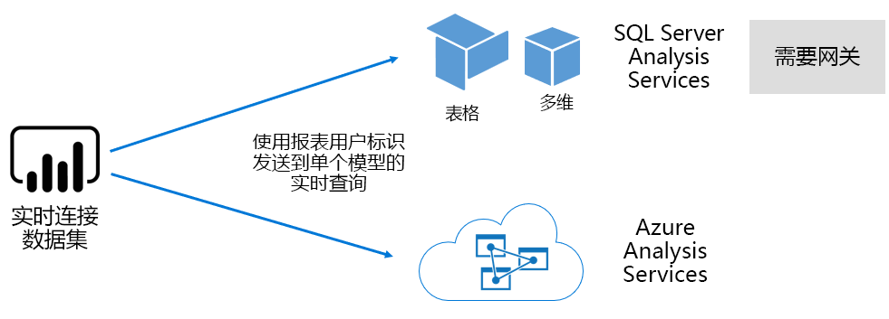
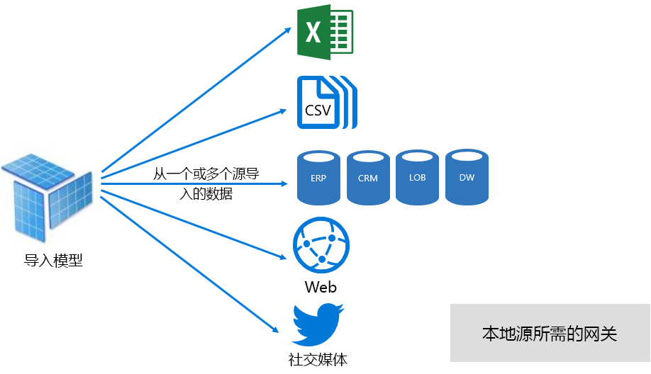
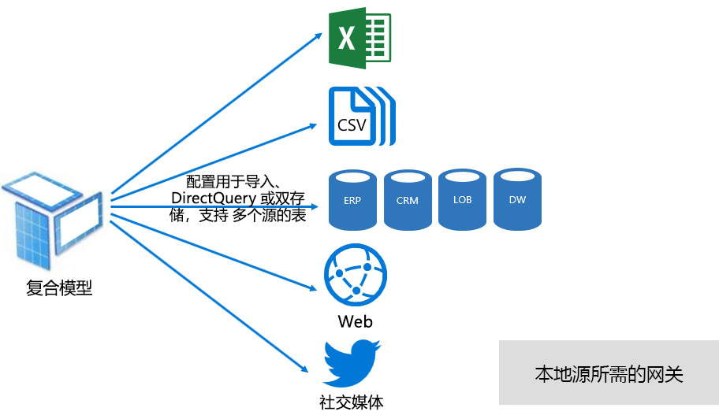
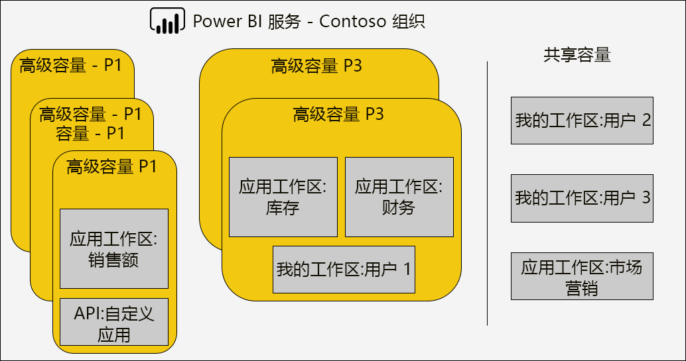
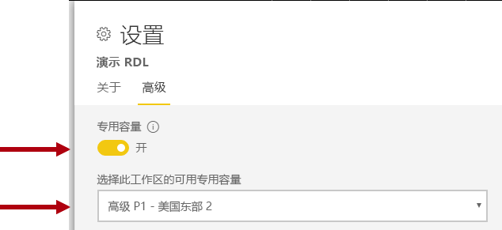
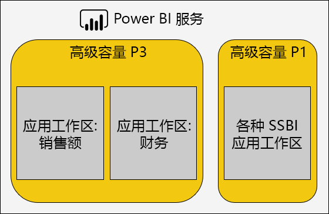
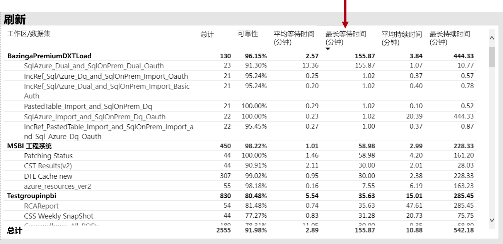
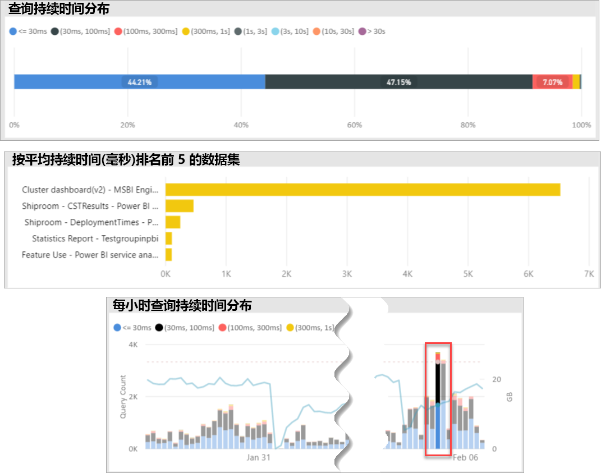
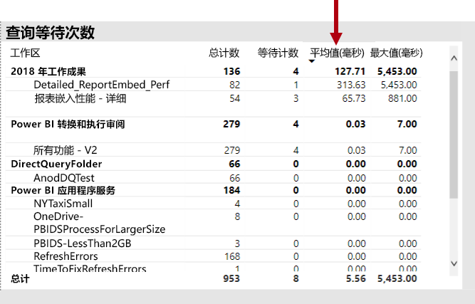
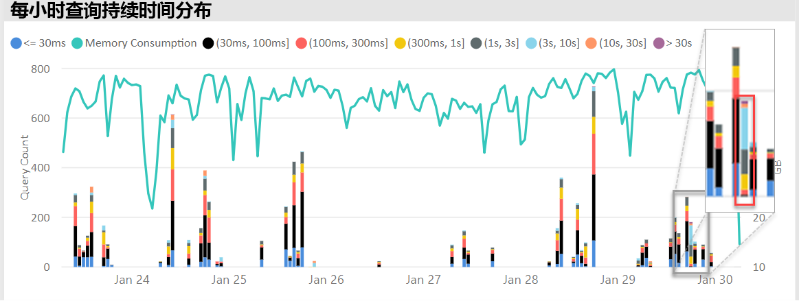

# 部署和管理 Power BI 高级容量

**摘要：** Power BI Premium 提供你的组织中的每个人更一致的性能、 对大型数据卷的支持和统一的自助服务和企业 BI 平台的灵活性。 此级别 300 技术白皮书已写入专用于 Power BI 管理员和内容编写者和发布服务器中。 它旨在帮助他们了解 Power BI Premium 的可能性，并说明如何设计、 部署、 监视和故障排除可缩放解决方案。

**作者：** [Peter Myers](https://www.linkedin.com/in/peterjsmyers) （数据平台 MVP 和独立的 BI 专家的按位解决方案）

**技术评审人员：** Adam Saxton、 Akshai Mirchandani、 Bhavik 商户、 David Magar、 Josh Caplan、 Michael Blythe，Nimrod Shalit、 Olivier Matrat、 Swati Gupta

**适用于：** Power BI 服务、 Power BI Premium 和 Azure Power BI Embedded 容量

> [!NOTE]
> 可以从浏览器中选择“打印”，然后选择“另存为 PDF”文件，以保存或打印此白皮书   。

## Power BI 简介

Power BI 是一种业务分析服务，旨在提供见解，使快速、 明智决策。 2015 年发布以来它已迅速成为使用提供的最小的组织的解决方案以最大的热门服务的企业。

它是可通过两种方式：作为云服务和本地报告解决方案名为**Power BI 报表服务器**。 \[[1](#endnote-01)\]

作为云服务-a-服务软件 (SaaS) 的 power BI \[ [2](#endnote-02)\]。 它表示一系列服务和应用程序，使组织能够开发、 部署、 管理和共享解决方案来监视其业务。

不为此白皮书旨在提供 Power BI 服务的全面描述。 相反，它重点介绍与使用者的 Power BI Premium 相关的主题。 有关 Power BI 的常规信息，请参阅全面[Power BI 文档](service-admin-premium-multi-geo.md)。 有关 Power BI 服务重点是实现良好的企业部署的更多详细说明，请参阅全面[规划 Power BI Enterprise 部署](https://aka.ms/pbienterprisedeploy)白皮书。

在本白皮书中的使用者的上下文中，本部分介绍并描述容量、 Power BI 内容类型、 模型的存储模式和授权。 了解这些主题对成功部署和管理 Power BI Premium 至关重要。

### 容量

**容量**是表示一组资源 （存储、 处理器和内存） 用于托管和交付 Power BI 的核心 Power BI 概念内容。 容量是为共享或专用。 一个**共享容量**是与其他 Microsoft 客户共享，而**专用容量**致力于单个客户。 中引入了专用的容量[高级容量](#premium-capacities)主题。

在共享容量中，工作负荷与其他客户共享计算资源上运行。 容量必须共享资源，进行了限制，以确保"公平播放"，例如最大的模型大小 (1 GB) 和 （八次 / 天） 的最大每日刷新频率。

### 工作区

Power BI 工作区位于容量以及它们所表示安全、 协作和部署容器。 每个 Power BI 用户都称为一个个人工作区**我的工作区**。 可以创建额外的工作区以实现协作和部署，并且这些参数称为**应用工作区**。 默认情况下，在共享容量中创建工作区 （包括个人工作区）。

### Power BI 内容类型

为了介绍 Power BI Premium 主题，它是一定要先使用 Power BI 体系结构包括基本的内容类型的全面讨论。

所有 Power BI 内容存储和管理工作区的 Power BI 内容的容器中。 每个 Power BI 用户具有其自己的个人工作区，但常规最佳做法是创建应用工作区。 应用工作区启用 co-ownership 的内容和协作处理内容的功能。 它们还提供暂存和将内容分发到宽应用作为受众的能力。

以下的 Power BI 内容存储在工作区中：

- 数据流
- 数据集
- 工作簿
- 报表
- 仪表板

#### 数据流

Power BI 数据流可帮助组织统一分散源中的数据。 可考虑将它们作为数据准备和分阶段实现使用在模型中，但是它们不能直接作为源使用，用于报告。 他们会利用广泛的 Microsoft 数据连接器，启用来自本地和基于云的数据源的数据引入。

数据流可以仅创建和管理应用工作区中，它们将存储为实体中常见数据模型 (CDM) 在 Azure 数据湖存储第 2 代中。 通常情况下，它们被计划定期存储最新的数据刷新。

有关详细信息，请参阅[在 Power BI （预览版） 中的自助服务数据准备](service-dataflows-overview.md)文档。

#### 数据集

Power BI 数据集代表数据准备好进行报告和可视化效果的源。 有许多类型的数据集，创建的：

- 连接到未托管在 Power BI 容量的现有数据模型
- 上传包含模型的 Power BI Desktop 文件
- 上传 Excel 工作簿 （包含一个或多个 Excel 表和/或工作簿数据模型） 或逗号分隔值 (CSV) 文件上传
- 使用 Power BI 服务以创建推送、 流式处理或混合流式处理数据集

除了流数据集\[ [3](#endnote-03)\]，数据集表示一个数据模型，该功能利用 Analysis Services 的成熟建模技术。

请注意，在文档中，有时术语数据集和模型是可互换。 通常情况下，从 Power BI 服务角度来看它称为**数据集**，并从它被称为开发角度来看**模型**。 在本白皮书的上下文中它们的含义是几乎同样的事情。

##### 外部托管模型

连接到外部托管的模型涉及安装[的本地数据网关](service-gateway-onprem.md)连接到 SQL Server Analysis Services，无论是在本地还是托管 VM 的基础结构作为-服务 (IaaS)。 Azure Analysis Services 不需要网关。 模型的现有投资存在，通常构成部分的企业数据仓库 (EDW) 时，这种情况下通常非常有用。 它允许 Power BI 进行**实时连接**(LC) 到 Analysis Services 和会强制使用的 Power BI 报表用户标识的数据的权限。 对于 SQL Server Analysis Services，支持多维模型 （多维数据集） 和表格模型。 下图中所示，实时连接数据集将查询传递给外部托管模型中。

##### Power BI Desktop 开发模型

可以使用 power BI Desktop 的一个客户端应用程序适用于 Power BI 开发-开发一个模型是有效的 Analysis Services 表格模型。 可以通过从数据流，然后与其他数据源导入数据开发模型。 有关如何实现建模的详细信息时，超出了本白皮书的范围，务必要了解有三个不同类型的或模式的模型可以通过使用 Power BI Desktop 中开发。 这些模式确定是否将数据导入的模型，或者它是否在数据源中保持。 三种模式是：导入、 DirectQuery 和复合。 在我们将介绍每种模式的完整讨论[模型存储模式](#model-storage-modes)主题。

外部托管模型和模型在 Power BI desktop 中开发可以强制实施行级别安全性 (RLS) 来限制要检索特定用户的数据。 例如，分配到顶尖销售员安全组的用户只能查看分配到的销售区域的报表数据。 RLS 角色可以是动态或静态。 **动态角色**通过报表用户的筛选器时**静态角色**应用相同的筛选器的所有用户分配到的角色。

##### Excel 工作簿模型

创建数据集基于 Excel 工作簿或 CSV 文件会自动创建模型。 Excel 表和 CSV 数据将导入能够将转置 Excel 工作簿数据模型创建 Power BI 模型的同时创建模型表。 在所有情况下，文件数据导入模型。

区别，然后，可以进行有关表示模型的 Power BI 数据集：

- 它们可以托管在 Power BI 服务中，还是外部托管的 Analysis Services
- 它们可以存储导入的数据，或者它们可以发出直接传递查询请求到基础数据源或这二者的融合

下面是有关 Power BI 数据集表示模型的重要事实的摘要：

- 托管 SQL Server Analysis Services 模型需要网关来执行 LC 的查询
- Power BI 托管模型导入数据
  - 必须是完全加载到内存，以便它们可以进行查询
  - 需要刷新才能使数据保持最新，并直接通过 Internet 无法访问源数据时必须涉及到网关
- Power BI 托管模型使用 DirectQuery (DQ) 存储模式的要求到源数据的连接。 查询模型时，Power BI 向要检索当前数据的源数据发出查询。 直接通过 Internet 无法访问源数据时，此模式下必须涉及到网关。
- 模型可能会强制实施 RLS 规则，强制执行筛选器来限制特定用户访问的数据访问

若要成功部署和管理 Power BI Premium，务必了解托管模型、 其存储模式、 网关，导入数据的大小上的任何依赖项，并刷新类型和频率。 这些都可以有重大影响的 Power BI Premium 资源。 此外，模型设计本身包括其数据准备查询和计算可以添加到注意事项的组合。

还有必要了解 Power BI 托管导入模型可以根据计划刷新也是触发按需在 Power BI 服务中的用户。

设计优化后的模型更高版本中本技术白皮书讨论[优化模型](#optimizing-models)主题。

#### 工作簿

Power BI 工作簿是 Power BI 内容类型\[ [4](#endnote-04)\]。 它们已上载到 Power BI 服务，不应与创建数据集 （模型） 的已上传 Excel 工作簿混淆的 Excel 工作簿。 工作簿内容类型表示与工作簿，其中既能上传到 Power BI 服务或保留在 OneDrive 或 SharePoint Online 上的云存储中的连接。

请务必了解此内容类型不是 Power BI 数据可视化效果的数据源可用。 相反，它可以为 Power BI 服务中的工作簿使用打开 Excel Online。 此内容类型的主要目的是允许原来的 Excel 工作簿报告可从在 Power BI 服务中，并允许其数据的可视化效果固定到 Power BI 仪表板。

有关详细信息，请参阅[从 Excel 工作簿文件获取数据](service-excel-workbook-files.md)文档。

#### 报表

有两种类型的报表：Power BI 报表和分页的报表。

**Power BI 报表**提供交互式数据可视化体验，后者将连接到单个数据集。 报表通常旨在鼓励用户参与度，从而允许它们进行交互的功能，特别数组与包括筛选、 切片，交叉筛选和突出显示、 向上钻取、 向下钻取、 钻取，问答自然语言质疑、 关注、 页面导航、 局部突出显示、 查看书签和的详细信息。

在本白皮书的上下文中，务必要了解 Power BI 体系结构，Power BI 报表设计和用户交互都会影响对 Power BI 服务资源的方式：

- 若要加载和与基于导入模型的报表进行交互，该模型必须是完全加载到内存中 （无论是在 Power BI 服务中托管还是外部托管）
- 每个报表视觉对象发出查询来查询模型中检索数据
- 通常情况下，筛选器和切片器交互不涉及到对模型的查询。 例如，更改切片器选择-默认情况下需要重新加载页面上的每个视觉对象\[ [5](#endnote-05)\]
- Power BI 报表并不能保证显示当前数据，并可能会要求用户在刷新报表以重新加载报表页和其视觉对象
- 用户可以与 Q 和自然语言功能，可以提出问题、 提供 Power BI 报表设计允许它的数据集表示托管 Power BI 的数据导入模型或 LC 数据集配置为启用问题与解答

**分页报表**允许发布和呈现的 SQL Server Reporting Services (SSRS) 报表 (\*.rdl 格式)。 如其名称所示，或者在必须完全展开的数据的变量列表时要求指示需要打印到固定的页面大小，通常用于分页的报表。 例如，设计用于多页呈现 （而不是滚动在视觉对象中） 的发票和打印。

两种受支持的报表类型提供所选报表作者，从而允许他们选择类型基于要求的使用。 通常情况下，Power BI 报表非常适用于允许用户浏览和发现数据中，见解，而参数驱动的页的布局更适合分页的报表的交互式体验。

而不考虑报表类型实现响应式报表负载和数据更新 （当更改筛选器或参数），则必须提供可靠且性能良好的用户体验。

#### 仪表板

Power BI 仪表板旨在提供监视体验，从概念上讲非常不同于 Power BI 报表。 仪表板用于在单一管理平台上的显示来表达磁贴中的值和数据可视化效果。 通常情况下，仪表板提供较少比 Power BI 报表，应为无需交互某些仪表板设计的交互体验。 例如，在服务器机房中的非触摸屏幕上提供的无人参与的仪表板。 另一个重要差异是仪表板可能存在多个数据集，而 Power BI 中的源数据报告只基于单个数据集的磁贴。

请务必了解，仪表板旨在加载速度快，并且是为了将最新数据表示 （为 Power BI 服务所知） 在所有时间。 它并来实现这通过缓存查询结果中平铺，来做到这一点的每个仪表板。 事实上，它必须执行此操作的每个用户都有权访问强制执行动态 RLS 的模型为基础的仪表板。

立即刷新 Power BI 托管导入模型之后，Power BI 服务会自动更新仪表板查询缓存。 对于 LC 和 DQ 模型，数据集所有者有一定程度的控制 Power BI 服务更新缓存，可以配置为频繁地为每隔 15 分钟或很少至一周一次的频率。 请注意，LC 查询缓存更新将首先查询模型元数据以确定是否模型刷新已发生自上次缓存更新，并将无法继续更新缓存刷新以来未发生时。 此检查不适用于 DQ 模型，并因此会缓存更新将源数据是否已更改或不。

仪表板查询缓存更新根据的 DQ 和 LC 模型可能会显著影响 Power BI 服务资源和外部数据源。 请考虑具有 20 磁贴，所有基于 Azure Analysis Services 模型，它强制动态 RLS 的刷新每隔一小时，并且与 100 个用户共享此仪表板的仪表板。 如果数据集配置为刷新每隔一小时，这将导致至少 2000 (20 x 100) LC 查询。 这可以在 Power BI 服务和外部数据源上放置巨大负载，它还可能会超过可用资源限制。 中所述容量资源和限制[容量节点](#capacity-nodes)主题。

用户可以使用各种方法，需要 Power BI 服务资源中的仪表板进行交互。 具体而言，他们可以：

- 触发刷新仪表板磁贴，这可能会导致所有相关的 Power BI 托管数据导入模型的按需刷新
- 与问答自然语言功能，提出问题 （提供的仪表板设计允许它和数据集是 Power BI 托管数据导入模型或 LC 数据集配置为启用问答）
- 使用 Power BI 快速见解功能发现从基础数据集，并使用视觉对象，其中显示，以及它们 （提供磁贴所基于的是 Power BI 托管数据导入模型的数据集） 进行响应的见解
- 在仪表板磁贴，需要比较阈值可能频繁地每小时的磁贴值-，超出阈值时通知用户在 Power BI 服务上配置警报 (提供磁贴显示单个数值并基于是托管 Power BI 的数据导入模型的数据集）

### 模型存储模式

回想一下 Power BI Desktop，允许开发三种模式之一中的模型。 请务必了解每个数据模型存储模式和可能影响对 Power BI 服务资源的基本原理。 本部分介绍所有三种模式。 这些将进一步在本白皮书中优化模型主题中稍后详细讨论。

#### 导入模式

导入模式是用来开发模型，因为极快的性能与内存中查询，供建模，提高设计灵活性和特定 Power BI 服务功能 （问答、 Quick Insights 支持的最常见模式等等。)。 创建新的 Power BI Desktop 解决方案时，它是默认模式。

务必了解导入的数据始终存储到磁盘，必须将完全加载到内存，无法查询或刷新。 一次在内存中，导入模型实现提供极快的查询结果。 它还是请务必了解不存在要部分加载到内存的导入模型的概念。

刷新时，数据压缩和优化，然后存储到磁盘，由 VertiPaq 存储引擎。 当从磁盘加载到内存，它可能会看到 10 倍压缩率，并因此是合理需要 10 GB 的源数据可以压缩为大约 1 GB 的大小。 在磁盘上的存储大小可以在最前面的 20%减少实现此目的。 \[[6](#endnote-06)\]

提高设计灵活性可实现以下三种方式。 数据建模者可以：

- 通过将来自多个数据源-无论数据源类型和格式的数据缓存集成数据
- 创建数据准备查询时利用 Power Query 公式语言 （非正式地称为 M） 函数的整个集
- 利用数据分析表达式 (DAX) 函数的整个集时增强使用计算的列、 计算的表与度量值来实现的业务逻辑模型

下图中所示，导入模型可以将任意数量的受支持的数据源类型中的数据集成。

但是，尽管有明显的优点与导入模型相关联，有缺点过：

- 整个模型必须首先将加载到内存 Power BI 才能查询模型，随着数量和模型大小的增长的情况下在可用的资源将放置压力
- 模型数据仅为当前版本的最新的刷新，因此需要进行刷新，最好是按计划定期导入模型
- 完全刷新将从所有表中删除所有数据，并从数据源重新加载它。 这可以是非常占用大量时间和为 Power BI 服务和数据源的资源。 Power BI 已支持增量刷新，这可以避免截断和重新加载整个表，然后在对此进行了[Optimizing Power BI-Hosted 模型](#optimizing-power-bi-hosted-models)主题。

从 Power BI 服务资源的角度，导入模型要求：

- 足够的内存来查询或刷新时加载模型
- 处理资源和更多的内存资源来刷新数据

#### DirectQuery 模式

开发在 DirectQuery (DQ) 模式下的模型不导入数据。 相反，它们仅包含元数据，当查询问题到基础数据源的本机查询。

有两个主要原因，要考虑开发 DQ 模型。 第一个原因是当数据卷太大-即使时应用数据缩减方法-若要加载到模型或几乎无法刷新。 第二个原因是交付"准实时"数据，而不在计划的刷新限制 （48 时间一天的专用容量） 可以获得的内容时所需的报表和仪表板。

有与 DQ 模型相关联的几个优点：

- 导入模型的大小限制不适用
- 模型不需要刷新
- 使用报表筛选器和切片器进行交互时，报表用户将看到最新数据并刷新整个报表中检索当前数据
- 仪表板磁贴，基于 DQ 模型时可以自动更新为以每隔 15 分钟的频率

但是，有许多缺点和与 DQ 模型关联的限制：

- 该模型必须基于单一支持的数据源，并因此任何数据集成而必须已实现的数据源中。 支持的数据源是关系和分析系统，支持许多常用的数据存储\[ [7](#endnote-07)\]。
- 性能可能会很慢，可能会造成负面影响 （查询可以是大量占用 CPU 的） 在 Power BI 服务和数据源 （这不可能的分析查询优化）
- Power Query 查询不能太过复杂，但不限于 M 表达式和函数，可以转换为本机查询理解数据源
- DAX 函数都限制为可以转换为本机查询理解数据源，并且没有不支持计算的表或内置的时间智能功能
- 默认情况下，需要超过一百万行中的检索的模型查询将失败
- 具有多个视觉对象的仪表板可以显示的报表和不一致的结果，尤其是当数据源是易失性
- 问答和不支持快速见解

从 Power BI 服务资源的角度，DQ 模型要求：

- 最小内存可用来加载模型 （仅元数据） 查询时
- 有时大量的处理器资源，可以生成和处理发送到数据源的查询

有关详细信息，请参阅[Power BI Desktop 中使用直接查询](desktop-use-directquery.md)文档。

#### 复合模式

在复合模式下开发模型允许配置各个模型表的存储模式。 因此，它支持混合使用导入和 DQ 表。 它还支持计算的表 （使用 DAX 定义） 和多个 DQ 数据源。

表存储模式可以配置为导入、 DirectQuery 或双。 作为双存储模式配置的表是导入和 DirectQuery，且这让 Power BI 服务，以确定要在查询的查询的基础上使用的最有效模式。

复合模型尽可能提供最佳的导入和 DirectQuery 模式。 适当地配置时它们可将内存中模型的较高的查询性能与接近实时的数据从数据源检索的功能。

开发复合模型的数据建模者很可能在导入或双存储模式和事实类型表在 DirectQuery 模式下配置维度类型的表。 例如，考虑双模式和 DirectQuery 模式下的销售事实类型表中具有产品维度类型表的模型。 Product 表可以快速高效地查询从内存中呈现报表切片器。 然后可以在 DirectQuery 模式下相关的产品表的联接查询 Sales 表。 后一种查询可使单个有效本机查询，以加入产品和销售表和筛选的切片器值的生成。

一般情况下的优点和缺点，与每个模型模式可以视为要应用于复合模型中的表存储模式。

有关详细信息，请参阅[在 Power BI Desktop 中使用复合模型](desktop-composite-models.md)文档。

### 许可

Power BI 有三个许可证：

- Power BI（免费）
- Power BI Pro
- Power BI Premium

**Power BI 免费版**许可证允许个人登录到 Power BI 服务和处理其个人工作区中，通过发布模型和报表。 请务必了解不能使用此许可证来共享 Power BI 内容。 此许可证，顾名思义，是免费的。

**Power BI Pro**许可证允许创建和应用工作区中协作和共享和分发 Power BI 的个人内容。 它们还可以配置其数据集，以自动保持数据最新，包括从本地数据源的刷新。 此外，它们可以审核和管理数据的访问和使用方式。 此许可证时需要接收来自其他人共享的内容，除非该用户是与 Power BI 高级版专用容量相关联。

**Power BI Premium**许可证是租户级许可证，并对其进行讨论[引入 Power BI Premium](#introducing-power-bi-premium)部分。

有关 Power BI 授权的详细信息，请参阅[Power BI 定价](https://powerbi.microsoft.com/pricing/)页。

## Power BI Premium 简介

Power BI Premium 提供了统一自助服务和企业 BI 平台与缩放、 可靠的性能和可预测的成本。 它主要通过来实现此提供专用的资源来运行你的组织的 Power BI 服务。

此外，Power BI 高级版还提供许多企业功能：

- 经济高效的内容分发，启用共享到不受限制的 Power BI 免费用户，包括外部用户的 Power BI 内容
- 对更大的数据集大小的支持\[ [8](#endnote-08)\]
- 更高的刷新率的数据流和数据集 （最多 48 个次 / 天）
- 增量刷新的数据流和数据集
- 数据流链接实体和并行执行的转换
- 分页报表
- Power BI 报表服务器，以实现本地报告
- 能够在应用中嵌入内容，代表应用程序用户 (PaaS)

其中的许多功能可用于交付高效、 可缩放的企业解决方案并在中介绍[优化高级容量](#optimizing-premium-capacities)部分。

### 订阅和授权

Power BI Premium 是租户级 Office 365 订阅中两个 SKU/单位 （库存单位） 系列提供：

- **EM** Sku (EM1 EM3) 嵌入内容，要求每年承诺，按每月计费
- **P** Sku (P1-P3) 嵌入内容和企业功能，需要每月或每年承诺，每月计费，包括 Power BI 报表服务器安装在本地安装的许可证

另一种方法是购买 Azure Power BI Embedded 订阅具有单一的 SKU 系列：**一个**用于嵌入和仅供测试使用的容量的 Sku (A1 A6)。

所有 Sku 都提供用于创建容量的 v 核心\[ [9](#endnote-09)\]，但限制为较小的规模嵌入于 EM Sku。 本白皮书的焦点在 P Sku 上时，多所讨论内容也是还与 A Sku。

与高级版订阅的 Sku，Azure Sku 不需要时间做出任何承诺，并且按小时计费。 它们提供完整的灵活性使缩放其向上、 向下缩放、 暂停、 恢复和删除。

Azure Power BI Embedded 是很大程度上不在范围内有关本白皮书中，但它测试方法主题中讨论作为今天这样切实可行且经济的选项进行测试和测量工作负荷。

有关 Azure Sku 的详细信息，请参阅[Azure Power BI Embedded 文档](/azure/power-bi-embedded/)。

由 Microsoft 365 管理中心中的管理员来购买 power BI Premium 订阅。 具体而言，只有 Office 365 全局管理员或计费管理员才可以购买的 Sku。

购买后，租户会获得对应数量的 v 核心数，以将分配给容量-这称为**v 核心池**。 例如，购买 P3 SKU 会为租户提供 32 的 v 核心。

有关详细信息，请参阅[如何购买 Power BI Premium](service-admin-premium-purchase.md)文档。

### 高级容量

与共享容量其中与其他客户共享计算资源运行的工作负荷相比**专用容量**供独占使用的组织。 它是隔离的专用计算资源提供可靠且一致的性能承载的内容。

本白皮书重点介绍**高级容量**，这意味着它是与 EM 或 P Sku 的任何相关联。

#### 容量节点

作为订阅和授权主题中所述，有两个 Power BI Premium SKU 系列：EM 和 p.所有 Power BI Premium Sku 都都为容量的节点，提供了每个元素表示一个设定的处理器、 内存和存储组成的资源。 除了资源外，每个 SKU 的每秒的 DirectQuery (DQ) 和实时连接 (LC) 连接数有操作限制并并行模型数刷新。

处理通过一定的 v 核心后, 端和前端之间平均分配。

**后端虚拟核心**负责核心 Power BI 功能，包括查询处理、 缓存管理、 运行 R services、 模型刷新、 自然语言处理 （问答） 和服务器端呈现的报表和图像。 后端虚拟核心分配固定的量的内存，这是主要用于映射到主机模型，这也称为活动数据集。

**前端虚拟核心**会负责 web 服务、 仪表板和报表文档管理、 访问 rights management、 时间安排、 Api、 上传和下载，并通常与用户相关的所有内容的体验。

每个容量节点设置为 100 TB 存储。

资源和每个高级 SKU 的限制 （和具有相对大小 SKU） 以下表所述。

| 容量节点 | 总虚拟核心 | 后端 V 核心 | RAM (GB) | 前端 V 核心 | DQ/LC （每秒） | 模型刷新并行度 |
| --- | --- | --- | --- | --- | --- | --- |
| EM1/A1 | 1 | 0.5 | 2.5 | 0.5 | 3.75 | 1 |
| EM2/A2 | 2 | 1 | 5 | 1 | 7.5 | 2 |
| EM3/A3 | 4 | 2 | 10 | 2 | 15 | 3 |
| P1/A4 | 8 | 4 | 25 | 4 | 30 | 6 |
| P2/A5 | 16 | 8 | 50 | 8 | 60 | 12 |
| P3/A6 | 32 | 16 | 100 | 16 | 120 | 24 |
| | | | | | | |

#### 容量的工作负荷

容量的工作负荷是对用户可用的服务。 默认情况下，高级版和 Azure 容量支持仅与运行 Power BI 查询不能禁用相关联的数据集工作负荷。

可以为分页的报表、 数据流和 AI 启用额外的工作负载。 每个额外的工作负荷需要配置可由工作负荷的最大内存 （作为总可用内存的百分比表示）。

#### 容量的工作原理

在任何时候，致力于在 Power BI 服务，以便充分利用容量资源并不超过限制的容量。

容量操作分类为交互式或背景。 交互式操作包括呈现请求和响应用户交互 （筛选、 问答查询等）。 通常情况下，导入模型查询是内存占用大量资源，而查询 LC/DQ 模型是大量占用 CPU。 后台操作包含数据流和导入模型刷新和仪表板查询缓存。

请务必了解交互操作将始终优先于后台操作，以确保最可能的用户体验。 如果有足够的资源，后台操作被添加到一个队列用于处理当资源释放。 后台操作，如数据集刷新和 AI 函数可能是由 Power BI 服务已停止中间过程，并添加到队列。

导入模型必须是完全加载到内存，以便它们可以查询或刷新。 Power BI 服务管理内存使用情况通过复杂的算法，以确保最充分地利用可用内存，而且可达到过载容量：虽然可以为最多可存储多个导入模型中 (每个高级容量最多 100 TB)，当他们组合的磁盘的存储超出了支持的内存 （和更多的内存是查询和刷新所必需的），然后它们均不能为加载到内存中相同的时间。

因此，导入模型是加载到的从-根据使用情况的内存中删除。 导入模型加载时它查询 （交互式操作） 和尚不在内存中，或者当它是要刷新 （后台操作）。

将模型从内存中的删除名为**逐出**，和是 Power BI 可以快速执行具体取决于模型的大小的操作。 如果容量未遇到任何内存不足的情况，只需加载到内存和模型一直留在那里。 \[[10](#endnote-10) \]但是，可用于加载模型内存不足时，Power BI 服务将首先需要释放内存。 它通过检测通过设法在过去三分钟内未使用过的模型已变为不活动状态的模型来释放内存\[ [11](#endnote-11)\]，，然后将它们逐出。 如果没有处于非活动状态模型中收回，Power BI 服务将设法逐出的后台操作加载的模型。 这可能包括后台工作负载，如 AI 工作负荷的逐出。 最后的手段，在 30 秒的失败尝试后\[ [11](#endnote-11)\]，是交互式操作失败。 在这种情况下，报表用户正常使用一项建议，若要稍后重试失败的通知。

请务必强调数据集逐出处于正常和预期行为。 它致力于实现最大内存使用情况加载和卸载的模型合并的大小可能会超过可用内存。 这是通过设计，与报表用户完全透明。 高驱逐率不一定意味着不足的资源容量。 如果查询或刷新响应能力，正是由于高驱逐率，他们便可以但是，会成为问题。

刷新的导入模型始终会消耗大量内存，因为必须加载到内存中模型，处理所需的更多的内存。 完全刷新可以使用大约两倍的模型所需的内存量。 这可确保即使正在处理该模型可以进行查询 （查询发送到现有模型中，直到刷新已完成，并且有可用的新模型数据）。 请注意，增量刷新需要较少的内存和更快，无法完成并因此可以显著减少容量资源的压力。 刷新也可以是大量占用 CPU 的模型，尤其是具有复杂的 Power Query 转换或计算的表/列的复杂或基于大型表。

刷新的类似查询-需要模型加载到内存中。 如果没有足够的内存，Power BI 服务将尝试逐出处于非活动状态的模型，如果这是不可能 （为所有模型都处于活动状态），刷新作业排入队列。 刷新是通常大量占用 CPU 的甚至更多，而不是查询。 出于此原因，有容量限制并发刷新，将设置为 1.5 倍的后端虚拟核心，向上舍入数的数量。 如果有太多并发刷新，计划的刷新将进行排队。 发生这种情况下，长刷新完成。 请注意 （由用户请求或 API 调用触发） 的按需刷新将重试三次\[ [11](#endnote-11)\]，然后失败，仍有不足够的资源。

## 管理 Power BI Premium

管理 Power BI Premium 包括购买订阅，并创建、 管理和监视高级容量。

### 创建和管理容量

**容量设置**页**Power BI 管理员**门户显示购买的 v 核心数和可用 (即尚未以分配到容量)，并列出高级容量。 页面允许 Office 365 全局管理员或 Power BI 服务管理员若要从可用的 v 核心，创建高级容量或修改现有的高级容量。

在创建高级容量时，管理员需要定义：

- 容量名称 （在租户中唯一）
- 容量管理员
- 容量大小
- 针对数据驻留位置的区域\[ [12](#endnote-12)\]

必须分配至少一个容量管理员。 作为容量管理员分配的用户可以：

- 向容量分配工作区
- 管理用户权限时，若要添加更多容量管理员或具有分配权限 （以使他们能够向容量分配工作区） 的用户
- 管理工作负荷，若要配置分页的报表和数据流工作负荷的最大内存使用情况
- 重新启动的容量，若要重置所有操作发生时系统超载\[ [13](#endnote-13)\]

容量管理员不能访问工作区内容 （除非显式分配了工作区权限） 并且不具备所有 Power BI 管理员区域访问权限 （除非显式分配） 的使用情况指标、 审核日志或租户设置等。 重要的是，容量管理员不有权创建新的容量或扩展现有的容量。 此外，在分配每个容量基础，确保它们仅可以查看和管理它们分配到的容量。

通过在池中的可用 v 核心数，必须从可用的 SKU 选项列表仅限于选择容量大小。 可以从池中的可能来源于一个创建多个容量或更多购买 Sku。 例如，P3 SKU （32 个 v 核心） 无法用于创建三个容量： 一个 P2 (16 个 v 核心），和两个 P1 （2 x 8 虚拟核心）。 通过创建较小大小的容量，可能会实现改进的性能和规模和本主题中讨论了[优化高级容量](#optimizing-premium-capacities)部分。 下图显示了一个虚构的 Contoso 组织包含五个高级容量的设置的示例 (3 倍 P1 版和 2 x P3) 与每个包含的应用工作区，并在共享容量中的多个工作区。

高级容量可分配给 Power BI 租户，提供 Power BI 内容位于不同的数据中心 （在规定的地理区域） 的管理控制的主区域以外的区域。 \[[12](#endnote-12)\]

Power BI 服务管理员和 Office 365 全局管理员可以修改高级容量。 具体而言，他们可以：

- 更改容量大小以纵向扩展或缩减资源。 但是，不能降级为 EM SKU，P SKU 或升级，反之亦然。
- 添加或删除容量管理员
- 添加或删除具有分配权限的用户
- 添加或删除额外的工作负载
- 更改区域

分配权限需要为特定的高级容量分配工作区。 可以向整个组织、 特定用户或组授予权限。

默认情况下，高级容量支持与运行 Power BI 查询相关联的工作负荷。 它还支持三个额外的工作负载：**分页报表**，**数据流**，和**AI**。 每个工作负荷需要配置可由工作负荷的最大内存 （作为总可用内存的百分比表示）。 请务必了解，增加最大内存分配可能会影响可托管的活动模型的数量和刷新的吞吐量。

内存动态分配给数据流，但静态分配给分页报表。 以静态方式分配的最大内存的原因是分页的报表运行在受保护包含空间的容量中。 设置分页报表内存，因为它减少了加载模型的可用内存时应小心。

|                     | EM3                      | P1                       | P2                      | P3                       |
|---------------------|--------------------------|--------------------------|-------------------------|--------------------------|
| 分页报表 | N/A | 默认为 20%，最低为 10% | 默认为 20%，最低为 5% | 默认为 20%，最低为 2.5% |
| 数据流 | 默认为 20%，最低为 8%  | 默认为 20%，最低为 4%  | 默认为 20%，最低为 2% | 默认为 20%，最低为 1%  |
| AI | N/A | 20%的默认值;最小的 20%  | 默认为 20%，最低为 10% | 默认为 20%，最低为 5%  |
| | | | | |

正在删除高级容量可能并不会删除其工作区和内容。 相反，它会将任何已分配的工作区移动到共享容量。 不同的区域中创建的高级容量，在工作区将移到共享容量中的主区域中。

### 将工作区分配到容量

工作区可以分配给高级容量中**Power BI 管理员** **门户**或-为应用工作区-在**工作区**窗格。

容量管理员和 Office 365 全局管理员或 Power BI 服务管理员，可以批量分配工作区中的**Power BI 管理员** **门户**。 大容量分配可以应用于：

- **按用户分配工作区**:包括个人工作区，这些用户拥有的所有工作区分配给高级容量。 当已经将它们分配到不同的高级容量时，这将包括工作区重新分配。 此外，用户还分配工作区分配权限。

- 特定工作区 
- **整个组织的工作区**:所有工作区，包括个人工作区，将分配给高级容量。 此外，所有当前和未来用户分配工作区分配权限。 \[[14](#endnote-14)\]

工作区可以通过使用添加到高级容量**工作区**窗格提供用户的这两个工作区管理员和具有分配权限。

工作区管理员可以删除从容量 （到共享容量） 工作区，而无需分配权限。 有效地从专用容量中删除工作区将重新在工作区分配到共享容量中。 请注意，从高级容量中删除工作区可能有负面影响生成，例如，在共享的内容变得不可用到 Power BI 免费版中获得许可的用户或计划刷新的挂起时它们超出了支持的限额通过共享容量。

在 Power BI 服务中，由装饰的工作区名称的菱形图标轻松地标识分配给高级容量的工作区。

### 监视容量

监视高级容量为管理员提供了如何执行容量的了解。 可以使用监视容量[Power BI Premium 容量度量值应用](service-admin-premium-monitor-capacity.md)或[Power BI 管理门户](service-admin-premium-monitor-portal.md)。

#### 解释指标

应该监视度量值来建立一个基本了解资源使用情况和工作负荷活动。 如果容量变得缓慢，务必了解要监视的指标，还可得出的结论。

理想情况下，查询应在向报表用户提供响应式体验，并启用更高的查询吞吐量一秒钟内完成。 它通常是问题的考虑的较小时 （包括刷新） 的背景过程要花费更长的时间才能完成。

一般情况下，慢速报告可能会过度加热容量的指示。 时报表将无法加载，这是过度加热容量的指示。 在任一情况下，根本原因可能是因引起的许多因素，包括：

- **查询失败**肯定指示内存压力和模型无法加载到内存中。 在 Power BI 服务将尝试加载模型，在失败之前的 30 秒。

- **过多的查询等待时间**可以是由于多种原因引起：
  - 需要为第一个 Power BI 服务中收回模型，然后加载要查询的模型 （回想一下，更高版本数据集逐出费率单独不相对值的指示容量压力，除非查询的长时间等待指示内存抖动附带）
  - 模型加载时间 （尤其是等待加载到内存的大型模型）
  - 长时间运行查询
  - （超出容量限制） 的 LC\DQ 连接过多
  - CPU 饱和度
  - 在页上 （回想一下每个视觉对象是一个查询） 的复杂报表设计与过多的视觉对象
- **长查询持续时间**可以指示，模型设计未得到优化，尤其是在多个数据集处于活动状态中的容量，并只有一个数据集是否生成长时间查询持续时间。 这表明，足够的资源容量，并在问题数据集是非最优或只是速度缓慢。 长时间运行的查询可能存在问题，因为它们可以阻止其他进程所需的资源的访问权限。
- **长时间刷新等待时间或 AI 调用等待时间**指示由于多个活动模型消耗的内存，内存不足或有问题的刷新阻止其他刷新 （超过并行刷新限制）。

如何使用指标的更多详细的说明中介绍了下一步[优化高级容量](#optimizing-premium-capacities)部分。

## 优化高级容量

当高级容量性能问题出现时，常见的第一种方法是优化或调整已部署的解决方案来还原可接受的响应时间。 重写基本原理是为了避免购买更多高级容量，除非它都可以进行调整。

当需要更多的高级容量时，有两个选项将讨论在本部分中的更高版本：

- 纵向扩展高级容量
- 添加新的高级容量

最后，测试方法和高级容量大小调整将结束此部分。

### 常规最佳做法

努力实现最佳利用率和性能存在时，可在板上作为一般性建议采取的一些最佳做法。 其中包括：

- 使用应用工作区，而不个人工作区
- 将业务关键和自助服务 BI (SSBI) 分成不同的容量

  

- 如果只适用于 Power BI Pro 用户共享内容，可能无需在专用容量中存储的内容
- 使用专用的容量，或在特定的功能是必需的例如大型数据集或分页报表时希望实现特定的刷新时间

### 解决常见的问题

优化 Power BI Premium 部署是一个复杂的主题涉及了解工作负荷要求、 可用资源和有效使用。

本主题介绍了七个常见支持问题，说明可能存在的问题和说明，以及如何确定和解决这些问题的信息。

#### 为什么是很慢，容量，该怎么办？

有许多原因可以导致速度缓慢的高级容量。 此问题需要进一步信息，了解通过缓慢的含义。 将报表加载缓慢？ 或无法加载它们？ 报表视觉对象速度较慢加载或更新时用户与报表进行交互？ 刷新需要完成而不是，或者以前遇到较长时间？

具有获得了原因的了解，你可以然后开始进行调查。 对以下六个问题的回答将帮助你解决的详细信息的特定问题。

#### 哪些内容使用了我容量？

可以使用**Power BI Premium 容量指标**应用筛选器的容量，并查看性能指标的工作区内容。 就可以查看性能指标和资源使用情况的 Premium 容量中存储的所有内容在过去七天的小时。 这通常是有关高级容量性能普遍的关注问题进行故障排除时要执行的第一步。

要监视的关键度量值包括：

- 平均 CPU 时间和高使用率计数
- 平均内存和高使用率计数和内存使用情况的特定数据集、 数据流和分页的报表
- 加载到内存中的活动数据集
- 平均值和最大查询持续时间
- 平均查询等待时间
- 平均数据集和数据流刷新时间
- 平均 AI 调用时间和等待时间

此外，在 Power BI Premium 容量度量值应用，活动内存显示分配给一个报表，不能被逐出，因为它是在过去三分钟内使用的内存总量。 高出现刷新等待时间可能与大型和/或活动的数据集相关。

"前 5 的平均持续时间"图表突出显示前五个数据集、 分页的报表、 数据流和 AI 调用消耗容量资源。 前五个列表中的内容是调查和可能的优化的候选对象。

#### 为什么是报告缓慢？

下表显示可能存在的问题以及如何处理标识和处理它们。

##### 没有足够的容量资源

| 查看可能的原因 | 如何识别 | 如何解决 |
| --- | --- | --- |
| 高总活动内存 （因为它是在过去三分钟内使用，不能逐出模型）   查询等待时间中的多个高峰值   在刷新中的多个高峰值等待时间 | 监视内存指标\[ [18](#endnote-18)\]，并将其移出计数\[ [19](#endnote-19)\] | 减少模型规模如何，或将转换为 DirectQuery 模式-请参阅[优化模型](#optimizing-models)在本部分中的主题   纵向扩展容量   将内容分配到不同的容量 |

##### 效率低下的报表设计

| 查看可能的原因 | 如何识别 | 如何解决 |
| --- | --- | --- |
| 报表页包含许多视觉对象 （交互式筛选可以触发每个视觉对象至少一个查询）   视觉对象中检索不必要的数据 | 查看的报表设计   若要了解如何与报表进行交互的访谈报表用户   监视数据集查询指标\[ [20](#endnote-20)\] | 重新设计的报表中每页更少的视觉对象 |

##### 数据集慢 （尤其是当报表执行了好）

| 查看可能的原因 | 如何识别 | 如何解决 |
| --- | --- | --- |
| 越来越多地大容量导入数据   复杂或低效的计算逻辑，包括 RLS 角色   模型未完全优化   (DQ/LC)网关延迟   DQ 源查询响应时间较慢 | 查看模型设计   监视网关的性能计数器 | 请参阅[优化模型](#optimizing-models)在本部分中的主题 |

##### 高并发报告使用情况

| 查看可能的原因 | 如何识别 | 如何解决 |
| --- | --- | --- |
| 较高的查询等待时间   CPU 饱和度   超出 DQ/LC 连接限制 | 监视 CPU 使用率\[ [21](#endnote-21)\]，查询等待时间和 DQ/LC 利用率\[ [22](#endnote-22) \]指标 + 查询持续时间 – 如果波动可以指示并发问题 | 纵向扩展容量，或将内容分配到不同的容量   重新设计的报表中每页更少的视觉对象 |

#### 为什么是报表不加载？

报表将无法加载它时，坏的情况下，并确保登录的容量内存不足，和是过度激烈。 当所有加载的模型正在主动查询，因此不能被逐出，并且任何刷新操作已暂停或延迟，这会发生。 Power BI 服务将尝试将数据集加载为 30 秒，并且使用一项建议，若要稍后重试失败的适当地通知用户。

目前没有任何要监视加载失败的报表的指标。 可以通过监视系统内存，特别是最高利用率和利用率最高的时间来确定此问题的可能性。 高数据集逐出和长时间的数据集刷新平均等待时间可能表明发生了此问题。

如果只有很少发生这种情况，这可能会不被视为优先级问题。 报表用户被通知服务正忙，并且它们应该试一段时间之后。 如果过于频繁地发生这种情况，通过扩展高级容量或通过将内容分配给不同的容量可以解决此问题。

容量管理员 （和 Power BI 服务管理员） 可以监视**查询失败**度量值以确定当发生这种情况。 它们还可以重新启动的容量，重置所有操作发生时系统超载。

#### 为什么刷新不开始按计划？

计划的刷新开始时间不能保证。 前面曾提到，在 Power BI 服务将始终优先交互操作于后台操作。 刷新是在后台操作时满足两个条件时可能发生的：

- 没有足够的内存
- 未超过 Premium 容量支持并发刷新数

当不满足条件时，刷新会排队，直到条件较好。

对于完整的刷新，回想一下，至少双倍的当前数据集的内存大小是必需的。 如果没有足够内存可用，然后刷新不能开始直到模型逐出释放内存-这意味着延迟，直到一个或多个数据集变为非活动状态并被逐出。

回想一下，支持的最大并发刷新数设置为 1.5 倍后端虚拟核心，向上舍入。

当它不能开始下一步计划的刷新应开始之前，计划的刷新将失败。 从 UI 手动触发按需刷新将尝试在故障前运行最多三次。

容量管理员 （和 Power BI 服务管理员） 可以监视**平均刷新等待时间 （分钟）** 指标来确定计划的时间与操作的开始之间的平均延迟。

虽然通常不管理优先级，若要影响的实时数据刷新，确保有足够的内存可用。 这可能涉及隔离数据集添加到已知足够的资源容量。 还有可能与数据集所有者能够帮助错开或减少计划的数据刷新时间，以最大程度减少冲突无法协调管理员。 请注意不能查看刷新队列，或检索数据集计划管理员。

#### 为什么不是刷新速度缓慢？

刷新可以佳或感知速度缓慢 （作为上一个常见的问题地址）。

事实上慢速刷新时，可能会由于多种原因引起：

- 资源不足的 CPU （刷新可以是大量占用 CPU 的）
- 内存不足，导致刷新暂停 （它需要刷新以重新有利以 recommence 条件时开始）
- 非容量原因，包括数据源系统的响应能力、 网络延迟、 无效的权限或网关吞吐量
- 数据卷-一个充分的理由，若要配置增量刷新，请按如下所述

容量管理员 （和 Power BI 服务管理员） 可以监视**平均刷新持续时间 （分钟）** 度量值以确定随着时间推移，比较的基准和**平均刷新等待时间 （分钟）** 要确定之间的平均延迟的度量值的平均计划的时间与操作的开始之间的延迟。

增量刷新可显著减少数据刷新的持续时间，尤其是对于大型模型表。 有个增量刷新的四个好处：

- **刷新的速度要快**:表的一个子集需要加载、 减少 CPU 和内存使用情况，并刷新多个分区时可以获得更大的并行度
- **仅在需要时，会发生刷新**:可以将增量刷新策略配置为加载仅当数据更改
- **刷新会更可靠**:较短正在运行与易失性数据源系统的连接更不易遭受断开连接
- **模型保持剪裁**:可以将增量刷新策略配置为自动删除历史记录超出滑动窗口的时间

有关详细信息，请参阅[增量刷新 Power BI Premium 中](service-premium-incremental-refresh.md)文档。

#### 为什么是数据刷新不完成？

当数据刷新开始，但无法完成时，它可以是由于多种原因引起：

- 内存不足，即使在高级容量中，只有一个模型的模型大小即非常大
- 非容量原因，包括数据源系统断开连接、 无效的权限或网关错误

容量管理员 （和 Power BI 服务管理员） 可以监视**刷新失败由于内存不足**指标。

#### 为什么是 AI 调用失败？

AI 调用可能出于多种原因会失败。 若要开始 AI 工作负荷，请为 5 GB，但这不可能对一些输入数据集已经足够，所需的最小内存。 例如，自动化的机器学习模型训练需要至少两次，并且有时会多次输入数据集大小。 此外，如果它花费的时间超过两个小时才能完成，被终止的 AI 调用。 对于自动化计算机返回学习模型训练调用未完成的两个小时，在这两小时内中找到的最佳模型。  此外可以通过交互式请求，它具有更高优先级中断 AI 调用。

管理员应监视有其他优先请求的迹象 AI 的等待时间。 管理员还可以确保有足够的内存是可用于相对于输入的数据大小的 AI 工作负荷。 这可能涉及到隔离到已知具有足够的资源的容量的 AI 工作负荷。 还有可能与数据流所有者帮助错开或减少数据流刷新时间，以最大程度减少冲突无法协调管理员。 请注意，不能为管理员若要查看 AI 调用队列。

### 优化模型

最佳模型设计对提供高效、 可缩放解决方案至关重要。 但是，它是超出了本白皮书的范围提供的完整讨论。 相反，本部分将在优化模型时要考虑中提供关键领域。

#### 优化 Power BI 托管模型

托管在高级容量的优化模型可以在数据源和模型层来实现。

请考虑导入模型优化可能性：

在数据源层：

- 关系数据源可以进行优化，以便确保最快可以刷新由预先集成的数据，应用适当的索引、 表分区，分别对应于定义的增量刷新周期和具体化计算 （来代替计算模型的表和列） 或将计算逻辑添加到视图
- 可以通过使用关系存储区预先集成的非关系数据源
- 请确保网关有足够的资源，最好是在具有足够的网络带宽和较近的数据源中的专用计算机上

在模型层：

- Power Query 查询的设计可以尽量减少或消除复杂的转换，尤其是那些以合并不同的数据源 （数据仓库实现此目的在其提取-转换-加载阶段）。 此外，确保设置适当的数据源隐私级别，这可以避免需要 Power BI 加载完整的结果来生成所有查询的组合的结果。
- 模型结构确定要加载的数据，以及对模型大小直接影响。 它可以用于避免加载不必要的数据，通过删除列，删除行 （尤其是历史数据） 或通过加载 （但代价是正在加载详细的数据） 汇总的数据。 可以通过删除较大基数列 （尤其是文本列） 不存储或压缩非常高效地实现显著的大小缩减。
- 通过配置单向关系，除非有充足的理由允许双向筛选可以提高模型查询性能。 也可以考虑使用 CROSSFILTER 函数而不双向筛选。
- 聚合表可实现快速查询响应通过加载预汇总数据，但这会在较长的刷新时间增加的模型和结果的大小。 通常情况下，应为非常大的模型或复合模型设计保留聚合表。
- 计算的表和列模型大小增加，并会导致更长的刷新时间。 通常情况下，更小存储大小和速度更快的刷新时间可实现时具体化或计算数据源中的数据。 如果无法做到这一点，使用 Power Query 自定义列可以提供改进的存储压缩。
- 可能有机会来优化用于度量值和 RLS 规则，可能重写逻辑，以避免成本高昂的公式的 DAX 表达式
- 增量刷新可以极大地缩短刷新时间和节省内存和 CPU。 增量刷新还可以配置为删除历史数据保留模型大小剪裁。
- 无法为这两个模型重新设计了一个模型，有不同的域和冲突的查询模式时。 例如，某些报表存在高级基于聚合所有历史记录，并且可以容忍 24 小时的延迟。 其他报表关心的当天的数据，需要对各个事务进行细致访问。 而不是设计一个单一的模型来满足所有的报表，创建两个模型针对每个需求进行了优化。

请考虑优化了这样一些可能性 DirectQuery 模型。 当模型到基础数据源发出查询请求，数据源优化时提供响应模型查询。

 

在数据源层：

- 数据源可以进行优化以确保最快可以查询由预先集成的数据 （这是不可能在模型层），应用适当的索引，定义表分区，具体化汇总数据 （与索引视图） 和最小化计算的量。 传递查询需要仅筛选并执行索引的表或视图之间的内部联接时，才能够达到最佳的体验。
- 请确保网关有足够的资源，最好是在具有足够的网络带宽和较近的数据源中的专用计算机上

在模型层：

- Power Query 查询设计最好是应该应用无需进行转换-否则尝试保持转换到绝对最小
- 通过配置单向关系，除非有充足的理由允许双向筛选可以提高模型查询性能。 此外，模型关系应配置为采用强制引用完整性 （在这种情况下），将导致使用更高效的内部联接 （而不外部联接） 的数据源查询。
- 避免创建 Power Query 查询自定义列或模型计算的列-将这些数据源，在可能的情况中具体化
- 可能有机会来优化用于度量值和 RLS 规则，可能重写逻辑，以避免成本高昂的公式的 DAX 表达式

请考虑优化了这样一些可能性复合模型。 回想一下复合模型使多个导入和 DirectQuery 的表。

- 通常情况下，导入和 DirectQuery 模型的优化主题适用于使用这些存储模式的复合模型表。
- 通常情况下，致力于通过配置 （用于表示业务实体） 的维度类型表实现均衡的设计为双存储模式和事实类型表 （通常是大型表，表示操作的事实数据） 作为 DirectQuery 存储模式。 双存储模式意味着同时导入和 DirectQuery 存储模式，这样 Power BI 服务，以确定最高效的存储模式，以生成传递本机查询时使用。
- 请确保网关有足够的资源，最好是在具有足够的网络带宽和较近的数据源中的专用计算机上
- 聚合表配置为导入存储模式可以提供显著的查询性能增强功能时用于汇总 DirectQuery 存储模式事实类型表。 在这种情况下，聚合表将提高模型的大小以及刷新时间，并通常是实现更快速查询接受之列。

#### 优化外部托管模型

中所述的许多优化可能性[Optimizing Power BI-Hosted 模型](#optimizing-power-bi-hosted-models)主题也适用于使用 Azure Analysis Services 和 SQL Server Analysis Services 开发模型。 清除异常某些功能是它们当前不支持，包括复合模型和聚合表。

进行外部托管的数据集的其他考虑因素是相对于 Power BI 服务中托管的数据库。 对于 Azure Analysis Services，这意味着在 Power BI 租户 （主区域） 所在的同一区域中创建的 Azure 资源。 对于 SQL Server Analysis Services，iaas，这意味着托管在同一区域中，VM 并对于在本地，这意味着确保有效的网关安装程序。

另外，可能会以请注意，Azure Analysis Services 数据库和 SQL Server Analysis Services 表格数据库需要其模型完全加载到内存，以支持查询它们保持有根本倍感兴趣。 类似于 Power BI 服务中，需要有足够的内存来刷新如果在刷新过程模型必须保持联机状态。 不同于 Power BI 服务中，没有概念模型将自动过期入和移出内存根据使用情况。 Power BI Premium，因此，提供了更有效的方法来最大程度地使用较低的内存使用情况查询模型。

### 容量规划

高级容量的大小确定其可用内存和处理器资源和容量限制。 高级容量数也是一个考虑因素，以创建多个高级容量可帮助将工作负荷相互隔离。 请注意，存储 100 TB 是每个容量节点，这很可能是多个足以满足任何工作负荷。

确定的大小和数量的高级容量极具挑战性，尤其是对于你创建的初始容量。 第一步是了解表示的平均工作负荷容量大小调整时预期日常使用情况。 请务必了解并非所有工作负荷相等。 例如-某一端的一系列的 100 个并发用户访问包含单个视觉对象的单个报表页是能轻松地实现。 -在极端情况下的另一端 100 个并发用户访问 100 个不同的报表，每个都有 100 视觉对象在报表页上，将让容量资源的非常不同的需求。

因此，容量管理员将需要考虑许多因素特定于环境、 内容和预期使用情况。 重写的目的是以最大化容量利用率，同时还提供了一致的查询时间、 可接受的等待时间和驱逐率。 要考虑的因素可能包括：

- **模型大小和数据特征**:导入模型必须是完全加载到内存，这样的查询或刷新。 LC/DQ 数据集可能需要占用大量处理器时间和可能是大量的内存来评估复杂的度量值或 RLS 规则。 内存和处理器大小以及 LC/DQ 查询吞吐量受容量大小。
- **并发活动模型**:并发查询的不同导入模型将提供最佳响应能力和性能时它们保留在内存中。 应该有足够的内存来承载所有主要查询的模型，使用额外的内存来允许为其刷新。
- **导入模型刷新**:刷新类型 （完整或增量）、 持续时间和 Power Query 查询和计算的表/列逻辑的复杂性可能会影响内存和尤其是处理器使用情况。 并发刷新受容量大小 （1.5 x backend 虚拟核心，向上舍入）。
- **并发查询**:许多并发查询可产生在无响应报告时处理器或 LC/DQ 连接超出了容量限制。 这是包含多个视觉对象的报表页的情况尤其如此。
- **数据流，分页报表和 AI 函数**:容量可以配置为支持数据流、 分页的报表和 AI 功能，以及每个需要可配置的最大容量内存百分比。 内存动态分配到数据流，但它以静态方式分配给了分页的报表和 AI 工作负荷。

除了这些因素，容量管理员可以考虑创建多个容量。 多个容量允许的工作负荷隔离，可以配置，以确保优先级的工作负荷具有有保证的资源。 例如，可以创建两个容量与自助服务 BI (SSBI) 工作负荷分离业务关键型工作负荷。 业务关键的容量可以用于隔离大型公司的模型并为他们提供有保证的资源，其创作仅向 IT 部门授予访问权限。 可以使用 SSBI 容量来承载越来越多的较小的模型，与业务分析人员授予访问权限。 SSBI 容量有时可能会遇到可承受的查询或刷新等待。

随着时间推移，容量管理员可以平衡工作区之间的容量由工作区或容量，之间的工作区之间移动的内容和扩展或缩减容量。 通常情况下，承载较大则纵向扩展和更高的并发为您的模型向外扩展。

回想一下，购买许可证的租户提供的 v 核心。 购买**P3**订阅可用于创建一个，或达四个高级容量，即 1 个 P3，或 P2，x 2 或 4 x P1。 此外之前扩大到 P3 容量 P2 容量，可以考虑将拆分 v 核心用于创建两个 P1 容量。

### 测试方法

一旦决定容量大小，则可以通过创建在受控的环境执行测试。 今天这样切实可行且经济的选项是创建的 Azure (Sku) 容量，注意的是 P1 容量大小相同的 A4 容量，采用 P2 和 P3 容量 A5 和 A6 容量的大小相同分别。 Azure 容量可以快速创建，并按小时计费。 因此，测试完成后，它们可以轻松地删除以停止产生成本。

测试内容可以添加到创建的 Azure 容量的工作区，然后为单个用户可以运行报表来生成查询的实际和代表性工作负荷。 如果导入模型，也应执行针对每个模型的刷新。 监视工具然后可用来查看所有指标了解资源利用率。

务必测试可重复：应多次运行测试和他们应每次提供大约相同的结果。 这些结果的平均值可用于进行推断并估计 true 生产条件下的工作负荷。

若要生成压力测试，请考虑开发负载测试应用程序能够模拟实际工作负荷。 超出了本白皮书的范围是如何实现此目的的详细信息。 有关包括示例代码的详细信息，请参阅[负载测试 Power BI 应用程序与 Visual Studio 负载测试](https://blogs.msdn.microsoft.com/charles_sterling/2018/04/04/webinar-load-testing-power-bi-applications-with-visual-studio-load-test/)网络研讨会。

## 探索实际方案

在本部分中，将介绍几个实际的方案来描述常见的问题或挑战，如何识别它们，以及如何帮助解决这些问题：

- [保持最新数据集](#keeping-datasets-up-to-date)
- [识别速度缓慢响应数据集](#identifying-slow-responding-datasets)
- [识别原因偶尔缓慢的响应数据集](#identifying-causes-for-sporadically-slow-responding-datasets)
- [确定是否有足够的内存](#determining-whether-there-is-enough-memory)
- [确定是否有足够的 CPU](#determining-whether-there-is-enough-cpu)

步骤，以及图表和表的示例取自**Power BI Premium 容量度量值应用**（应用） 的 Power BI 管理员将有权访问。

### 数据集最多保留为日期

在此方案中，当用户抱怨报表数据有时似乎是旧的或"过时"时触发调查。

在应用中，管理员与进行交互**刷新**视觉对象，对数据集的排序**最大等待时间**降序排序的统计信息。 这有助于他们显示的数据集具有的时间最长等待时间，按工作区名称分组。

此外，在**每小时平均刷新等待时间**视觉对象，客户发现刷新等待时间一致地高峰下午 4 点左右每一天。

有几个可能的原因，对于这些结果：

- 尝试输入太多次刷新无法在发生在同一时间超出容量节点 （在默认内存分配与 P1 六个并发刷新） 所规定的限制

- 要刷新的数据集可能太大，无法装入可用内存 （需要至少 2 个完全刷新所需的内存）
- 效率低下的 Power Query 逻辑可能会在数据集刷新期间导致内存使用率峰值。 繁忙的容量，这可以偶尔会到达物理限制，故障刷新，并且可能会影响其他报表查看操作的容量。
- 经常查询需要保留在内存中的数据集可能会影响其他数据集的能力，若要刷新，由于有限的可用内存

若要帮助调查此问题，Power BI 管理员可以查看：

- 在数据刷新，当可用内存小于 2 倍的大小要刷新的数据集时的可用内存不足
- 数据集，不刷新并将未在内存中之前刷新，但其开始在大量的刷新时间显示交互式流量。 若要查看哪些数据集已加载到内存在任何给定时间 Power BI 管理员可以查看的数据集区域**数据集**通过单击其中一个条形图中的某一时刻应用和交叉筛选器中的选项卡**每小时加载数据集计数**。 本地峰值 （如下图所示） 指示当多个数据集已加载到内存中，这可能会延迟启动计划的刷新的一小时
- 增加数据集逐出采用放置时计划数据刷新开始时，指示存在内存严重不足时导致提供过许多不同的交互式报表刷新的时间之前。 **每小时的数据集逐出和内存消耗**视觉对象可以清楚地指示中逐出的峰值。

下图显示本地图文场中加载数据集，这表明交互式查询延迟刷新的启动。 选择一段时间**每小时加载数据集计数**视觉对象将交叉筛选器**数据集大小**visual。

Power BI 管理员可以尝试通过采取措施以确保有足够的内存可用于数据刷新首先解决该问题：

- 联系数据集所有者和询问他们分阶段以及隔开数据刷新计划
- 减少数据集查询负载通过删除不必要的仪表板或仪表板磁贴，尤其是那些以强制实施行级别安全性
- 通过优化 Power Query 逻辑来加快数据刷新，模型计算列或表，减少数据集的大小，或配置大型数据集来执行增量数据刷新

### 识别速度缓慢响应数据集

在此方案中，当用户抱怨某些报表花费了很长时间才能打开，请触发调查和有时会挂起。

在应用中，Power BI 管理员可以使用**查询持续时间**视觉对象，确定通过对数据集按降序进行排序的性能最坏的数据集**平均持续时间**。 此视觉对象还显示了数据集查询计数，以便您可以看到数据集查询的频率。

Power BI 管理员可以指**查询持续时间分布**视觉对象，则它显示了由 bucket 存储的查询性能的整体分布 (< = 30ms，0-100 毫秒，等) 筛选的时间段内。 通常情况下，查询，采用一秒或更少视为响应式大多数用户;往往会花费更长时间的查询创建的错误的性能体验。

**每小时查询持续时间分布**视觉对象，Power BI 管理员可以确定一个小时的时间段时容量性能可能具有已识别人不满意。 越大栏段表示查询持续时间超过一秒，较大的用户能够体会到性能不佳的风险。

视觉对象是交互式课程，并且在栏的段被选定时，相应**查询持续时间**表报表页上视觉对象进行交叉筛选，以显示它所代表的数据集。 此交叉筛选，Power BI 管理员可以轻松地识别该数据集响应速度慢。

下图显示了通过筛选一个视觉对象**每小时查询持续时间分布**，专注于一小时存储桶中的坏的情况下执行数据集。 

一旦确定特定的 1 小时时间范围中的较差性能数据集，Power BI 管理员可以调查性能不佳导致的重载的容量，还是由于效果不佳设计数据集或报表。 若要实现此目的，其可以引用**查询等待时间**视觉对象，并按降序平均查询等待时间排序数据集。 如果在等待了大量的查询，该数据集的高需求可能是许多查询等待的原因。 如果平均查询等待时间是大量 （> 100 毫秒），则可能需要查看的数据集和报表以查看是否可以进行优化。 例如，可能是更少的视觉对象上给定的报表页或 DAX 表达式优化。

有多种原因引起的查询等待时间生成设置中的数据集：

- 欠佳的模型设计、 度量值表达式或甚至报表设计的所有情况下，可能会导致长时间运行的查询占用的 CPU 的高级别。 这会强制新查询等待，直到 CPU 线程变为可用，可以创建过程在高峰业务时段期间的常见保护效果 （思考流量卡纸问题）。 **查询等待**页将是主要的资源，以确定数据集是否具有较高的平均查询等待时间。
- 大量并发容量用户 （几百到几千） 使用相同的报表或数据集。 超出了并发的阈值，甚至设计良好的数据集可以执行错误。 这通常由显示明显更高的值，用于对查询进行计数比其他数据集显示单个数据集 (即 300 K 查询的一个数据集相比 < 30 K 对于所有其他数据集的查询)。 查询等待此数据集将开始时间错开，这将出现在某个时候**查询持续时间**visual。
- 许多不同查询的数据集，如频繁周期入和移出内存的数据集，从而导致抖动。 这会导致用户数据集加载到内存时遇到性能变慢。 若要确认这一点，Power BI 管理员可以参考**每小时的数据集逐出和内存消耗**视觉对象，这可能指示大量的数据集加载到内存重复中逐出。

### 识别原因偶尔缓慢的响应数据集

在此方案中，当用户描述的报表视觉对象有时会觉得缓慢响应，或可能会变得无响应，但在其他情况下它们是可以接受响应时触发调查。

在应用中，**查询持续时间**部分用于按以下方式找到问题所在的数据集：

- 在中**查询持续时间**visual 管理员筛选数据集 （从查询顶部的数据集） 的数据集和检查中的交叉筛选的条形**每小时查询分发**visual。
- 当单个一小时条形显示在与该数据集的其他一小时条形图的所有查询持续时间组之间的比率的重大更改 （即比率的颜色之间更改极大地），则表示此数据集演示中的偶发更改性能。
- 显示较差的查询，具有不规则部分一小时条指示该数据集已受到干扰性邻居效果，由其他数据集的活动导致一个时间跨度。

下图显示在 1 月 30 日的一小时的数据集的性能明显退步发生，指示大小"（3,10s]"执行持续时间存储桶。 单击该一小时条形图将显示所有数据集加载到内存中，在此期间，因此呈现导致干扰性邻居效果的候选罪魁祸首数据集。

后 （例如，在期间年 1 月 30 日在上图中) 标识有问题的时间跨度的 Power BI 管理员可以删除所有数据集筛选器，然后仅按该 timespan，用于确定在此期间主动查询哪些数据集进行筛选。 Top 查询数据集或一个有时间最长平均查询持续时间，通常是干扰性邻居效果的罪魁祸首数据集。

此问题的解决方案可能是将通过不同的工作区在不同的高级容量，或如果数据集大小、 消耗要求和数据刷新模式共享容量上的数据集的原因。

反过来也可能是，则返回 true。 Power BI 管理员无法识别数据集查询性能大幅提高的时间，然后寻找什么消失。 如果在该点缺少某些信息，然后，可能有助于指向导致出现问题。

### 确定是否没有足够的内存

若要确定是否有足够的内存来完成其工作负荷的容量，Power BI 管理员可以参考**占用的内存百分比**的视觉对象**数据集**应用的选项卡。 **所有**（总计） 的内存表示数据集加载到内存中，无论它们是主动查询或处理所占用的内存。 **Active**内存表示正在主动处理的数据集所占用的内存。

在正常容量视觉对象将如下所示，其中显示所有 （总计） 之间的间距和活动内存：

在容量中遇到内存不足的情况，相同的视觉对象清晰显示活动内存和聚合，这意味着就无法加载到内存中的其他数据集，在某个时间点的总内存。 Power BI 管理员可以在这种情况下，单击**容量重启**(在**高级选项**的管理门户的容量设置区域)。 从内存刷新并允许其重新加载到内存中作为必需 （通过查询或数据刷新），在中所有数据集正在重新启动容量结果。

### 确定是否没有足够的 CPU

一般情况下，容量的平均 CPU 使用率应保持低于 80%。 超出此值意味着容量即将达到 CPU 饱和所致。

由操作花的时间比它们由于执行很多 CPU 上下文切换，因为它会尝试处理的所有操作的容量应表示的 CPU 饱和度的效果。 在高级容量使用大量的并发查询，这将由较高的查询等待时间。 较高的查询等待时间的结果是比平常慢的响应能力。 通过查看 CPU 处于满负荷状态时，Power BI 管理员可以轻松地识别**每小时查询等待时间分布区**visual。 定期峰值的查询等待的时间计数指示潜在 CPU 饱和所致。

类似的模式有时可以检测在后台操作，如果他们参与 CPU 饱和所致。 Power BI 管理员可以在特定的数据集，可用于指示在 （可能是由于其他正在进行的数据集刷新和/或交互式查询） 时的 CPU 饱和度的刷新时间中查找定期出现峰值。 在此情况下，指**系统**应用中的视图不会一定透露 CPU 已达到其 100%。 **系统**视图显示每小时平均值，但 CPU 可以变得满负荷状态几分钟的繁重的操作，这显示为峰值在等待时间。

有更多的细微差别，看到的 CPU 饱和度效果。 虽然等待的查询数很重要，查询等待时间将始终执行的操作在某种程度上而不会导致明显的性能下降。 更容易出现 CPU 饱和所致的效果比其他某些数据集 （具有更长的平均查询时，指示复杂性或大小）。 若要轻松识别这些数据集，Power BI 管理员可以查看中的条形的颜色组合中的更改**每小时的等待时间分发**visual。 后发现离群值栏，它们可以寻找具有查询等待这段时间内的数据集，并查找在进行比较以平均查询持续时间的平均查询等待时间。 如果这两个指标是相同的量级，数据集的查询工作负荷很重要的则可能的资源不足的 CPU 所影响的数据集。

在短暂突发高频率查询由多个用户 （即在培训课程），从而导致在每个迸发期间的 CPU 饱和度中使用数据集时，这种效果可能会变得尤为明显。 在这种情况下，此数据集上的重要查询等待时间即可体验以及影响容量 （干扰性邻居会有影响） 中的其他数据集上。

在某些情况下，Power BI 管理员可以请求数据集所有者，创建小于通过创建仪表板 （用于缓存的磁贴刷新哪些查询定期使用的任何数据集） 而不是报表的易失性查询工作负荷。 这可以帮助防止加载仪表板时的峰值。 此解决方案可能始终无法为给定的业务要求，但它可以是避免 CPU 饱和所致，而无需进行更改为数据集的有效方法。

## 结论

Power BI Premium 提供你的组织中的每个人更一致的性能、 对大型数据卷的支持和统一的自助服务和企业 BI 平台的灵活性。 此级别 300 技术白皮书已写入专用于 Power BI 管理员和内容编写者和发布服务器中。 它旨在帮助他们了解 Power BI Premium 的可能性，并说明如何设计、 部署、 监视和故障排除可缩放解决方案。

若要部署和管理 Power BI Premium 容量，管理员和模型开发人员将需要非常非常了解容量函数、 可以如何管理和监视，它们和如何模型优化，以适当地响应性能问题和瓶颈应出现。

## 结束注释

\[1\]以下技术文章涉及到 Power BI 高级版，它们仅支持通过 Power BI 云服务，因此 Power BI 报表服务器不在范围内，除为安装所需的许可证的状态，Power BI 报表服务器包含一些Power BI Premium Sku。

\[2\]作为云服务时用于嵌入内容代表应用程序的用户的 power BI 是平台-作为-服务 (PaaS)。 可以使用不同的两个产品，其中之一是 Power BI Premium 实现这种类型的嵌入。

\[3\]推送，流式处理和混合数据集不会存储在高级容量，因此不需要部署、 管理和监视高级容量。

\[4\]为 Power BI 的内容类型的 Excel 工作簿不会存储在高级容量，因此不需要部署、 管理或监视高级容量。

\[5\]视觉对象可以配置为忽略切片器交互。 有关详细信息，请参阅[Power BI 报表中的可视化交互](service-reports-visual-interactions.md)文档。

\[6\]可通过比较文件任务管理器内存使用的 Power BI Desktop 文件大小确定大小中的差异。

\[7\]支持 Microsoft 数据源包括 SQL Server、 Azure Data Bricks、 Azure HDInsight Spark （beta 版本）、 Azure SQL 数据库和 Azure SQL 数据仓库。 有关其他源的信息，请参阅[支持的 Power BI 中的直接查询数据源](desktop-directquery-data-sources.md)文档。

\[8\] power BI Premium 支持上传最大大小为 10 GB 的 Power BI Desktop (.pbix) 文件。 上传后，数据集可以增长超过 12 GB 的大小作为刷新结果。 最大上载大小因 SKU 而异。 有关详细信息，请参阅[Power BI Premium 支持大型数据集](service-premium-large-datasets.md)文档。

\[9\]采用不超过四个虚拟核心不会运行在专用基础结构的 Sku。 这包括 EM1、 EM2、 A1 和 A2 Sku。

\[10\]虽然罕见，但模型可能是从服务操作由于内存中卸载。

\[11\]这些执行时间可能会有所更改在任何时间。

\[12\]这被称为多地域，目前处于预览状态。 多地域部署的基本原理通常是为企业或政府法规遵从性，而不是性能和规模。 报表和仪表板加载仍然需要对元数据的主区域的请求。 有关详细信息，请参阅[对 Power BI Premium （预览版） 的多地域支持](service-admin-premium-multi-geo.md)文档。

\[13\]可以用户可能会导致性能问题通过重载具有作业的 Power BI 服务、 编写过于复杂的查询、 创建循环引用，等等。

\[14\]不建议分配整个组织的工作区的选项，并且更有针对性的方法是首选。 通常情况下，它不是生产内容使用个人工作区的最佳做法。

\[15\]就可以在应用程序或在 Azure 门户中，但不是在 Power BI 管理门户中监视 A Sku。 若要监视的 Sku，刷新报表如果应用尚未添加到资源的读取者角色将失败。 有关详细信息，请参阅[监视器 Power BI Premium 和 Power BI Embedded 容量](service-admin-premium-monitor-capacity.md)文档。

\[16\]没有足够的 CPU 或内存以启动时，可以等待刷新。

\[17\]内存中的数据集大小可能会大于最多 20%的磁盘上的大小。

\[18\]平均内存使用量 (GB) 和最高内存消耗 (GB)

\[19\]数据集逐出

\[20\]数据集查询数据集在数据集平均查询持续时间 （毫秒），等待计数和数据集的平均等待时间 （毫秒）

\[21\] CPU 高使用率计数和 CPU 时间的最高利用率 （过去 7 天）

\[22\] DQ/LC 高使用率计数和 DQ/LC 时间的最高利用率 （过去 7 天）